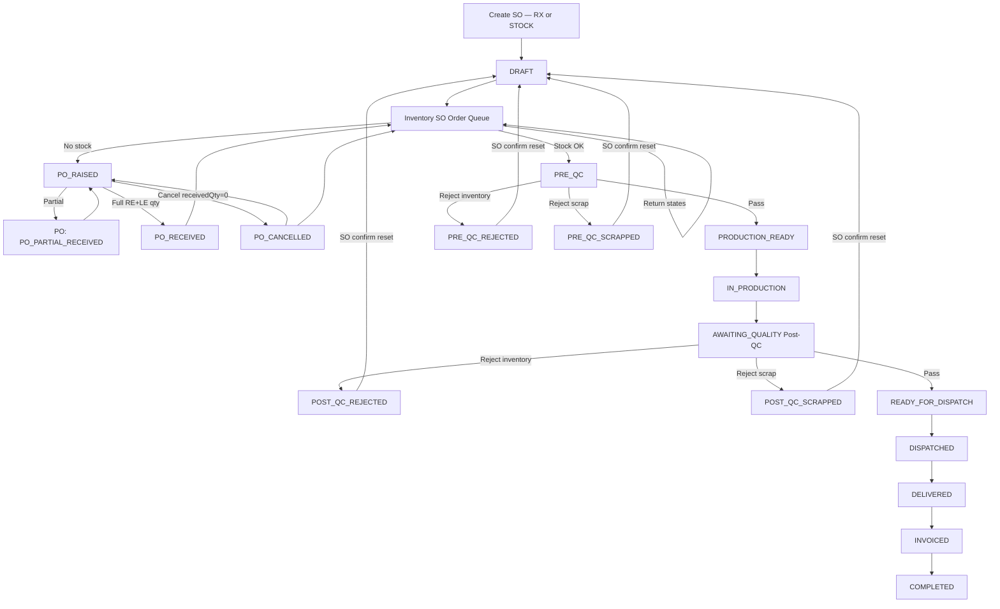

# SO Workflow — Phase-by-Phase Implementation Tasks

> **Spec status:** 🟢 **Fully clarified & frozen** (2026-06-24)  
> **Prerequisite:** Truncate / fresh DB before Phase 1 migration  
> **Reference:** Full business rules captured in this document + chat spec

---

## End-to-end flow (frozen)



---

## SO status enum (final)

| Status | Label |
|---|---|
| `DRAFT` | Draft |
| `PO_RAISED` | PO Raised |
| `PO_RECEIVED` | PO Received |
| `PO_CANCELLED` | PO Canceled |
| `PRE_QC` | Pre-QC |
| `PRE_QC_REJECTED` | Pre-QC Rejected (reusable) |
| `PRE_QC_SCRAPPED` | Pre-QC Scrapped |
| `PRODUCTION_READY` | Production Ready |
| `IN_PRODUCTION` | In Production |
| `ON_HOLD` | In Production (On Hold) |
| `AWAITING_QUALITY` | Post-QC |
| `POST_QC_REJECTED` | Post-QC Rejected (reusable) |
| `POST_QC_SCRAPPED` | Post-QC Scrapped |
| `READY_FOR_DISPATCH` | Dispatch Ready |
| `DISPATCHED` | Dispatched |
| `DELIVERED` | Delivered |
| `INVOICED` | Invoice Generated |
| `COMPLETED` | Completed |

**Log-only (not persisted status):** `STOCK_ISSUED` — recorded in `SaleOrderStatusLog` when inventory issues to Pre-QC station.

---

## Sidebar (frozen)

| Before | After | Route |
|---|---|---|
| Quality | **Post-QC** | `/quality/operator` (rename routes optional Phase 6) |
| — | **Pre-QC** (new) | `/pre-qc/operator` |

---

## Prior work (Lens Enhancements) — 🟢 Complete

> See `TASK_LENS_ENHANCEMENTS.md` — PO receive fix, GST, customer ref, grid stock, FIFO, etc.

- [x] 🟢 Phase 0A — Ledger seed, GST settings, PO UX
- [x] 🟢 Phase 0B — Form UX (clearZeroOnFocus, Dia 70, SV rules)
- [x] 🟢 Phase 0C — Grid bulk inward, inventory dropdown, customer ref unique

---

## Phase 1 — Database & schema 🟢 *Spec locked* — ✅ CODE READY

- [x] 🟢 Add `SaleOrderStatus` enum values
- [x] 🟢 Add `PO_PARTIAL_RECEIVED` to `POStatus` enum
- [x] 🟢 Create `SaleOrderStatusLog` model
- [x] 🟢 Add `hasLinkedPoEver`, `procurementType` on SaleOrder
- [x] 🟢 Seed **virtual location** (`scripts/seed-so-workflow-basics.js`)
- [x] 🟢 Migration SQL: `prisma/migrations/20260625190000_so_workflow_status/`
- [ ] **YOU RUN:** `npm run db:deploy` (after truncate / resolve failed migration)
- [ ] **YOU RUN:** `npm run test:so:p1`

## Phase 2 — Backend transition engine 🟢 — ✅ DONE

- [x] 🟢 `saleOrderStatusService.js` + `saleOrderStatus.js` constants
- [x] 🟢 `saleOrderWorkflowService.js` (raise/link/cancel PO, issue Pre-QC, queue)
- [x] 🟢 API routes on `/api/sale-orders/...`
- [x] 🟢 `npm run test:so:p2` — **24/24 passed**

## Phase 3 — Inventory SO Order Queue 🟢 — ✅ DONE

- [x] 🟢 `/inventory/so-queue` page + sidebar link
- [x] 🟢 `GET /sale-orders/inventory-queue`
- [x] 🟢 Issue & Pre-QC, Raise PO from queue

## Phase 4 — SO UI 🟢 — ✅ DONE

- [x] 🟢 `SaleOrderStatusBar` + `SaleOrderStatusLogDialog`
- [x] 🟢 Raise PO, Confirm reset on SO view
- [x] 🟢 Updated status labels/colors

## Phase 5 — Pre-QC module 🟢 — ✅ DONE

- [x] 🟢 Sidebar Pre-QC → `/pre-qc/operator`
- [x] 🟢 Pass / Reject inventory / Reject scrap

## Phase 6 — Production & Post-QC 🟢 — ✅ DONE

- [x] 🟢 Sidebar Quality → **Post-QC**
- [x] 🟢 Production queue: `PRODUCTION_READY`
- [x] 🟢 Post-QC dual reject + reset flow

## Phase 7 — Dispatch & billing 🟢 — ✅ DONE

- [x] 🟢 Dispatch pickup → `DISPATCHED`
- [x] 🟢 Invoice issue → `INVOICED`; full pay → `COMPLETED`

## Phase 8 — Verification 🟢 — ✅ DONE

- [x] 🟢 `npm run build` passes
- [x] 🟢 `npm run test:so:p2` passes (24/24)
- [x] 🟢 `npm run test:so:p1` passes (5/5)
- [x] 🟢 `npm run test:so:integration` passes (full workflow)
- [x] 🟢 `npm run test:api:smoke` passes (27/27 with auth)
- [x] 🟢 Customer/vendor `ledgerId` patch + backfill in seed

---

## Business rules quick reference 🟢

| Rule | Detail |
|---|---|
| Lens types | RX + STOCK both enter inventory queue |
| Issue | Physical move to Pre-QC station → SO `PRE_QC`; log stock issued |
| PO optional | Shelf first; PO when no stock; PO may be raised anytime but open PO blocks shelf issue |
| Partial PO | PO `PO_PARTIAL_RECEIVED`; SO stays `PO_RAISED` |
| Full PO | SO `PO_RECEIVED`; queue badge **issue pending** |
| Linked Single PO | No delete; cancel if `receivedQty = 0`; multiple PO records per SO |
| QC reject reusable | `PRE_QC_REJECTED` / `POST_QC_REJECTED` → SO confirm reset → `DRAFT` |
| QC scrap | `PRE_QC_SCRAPPED` / `POST_QC_SCRAPPED` → SO confirm reset → `DRAFT` |
| Logs | Never cleared |
| Earmarked Stock | Exclude from FIFO matching unless earmarked for the same sale order |
| Inward Queue & Tray Visibility | Show both physical inventory and inward queue items for Stock Pick |
| Source Type Badge | Display green RX (with PO number) and blue Stock badges in UI tables |
| Auto-Inward on Issue | Auto-create inventory item, log transaction, update stock, and reserve when transitioning to `IN_FITTING` |

---

## Explicitly on hold (post v1)

- [ ] Full return-to-stock / scrap inventory transaction UI
- [ ] BE/RE/LE selection enhancements
- [ ] CS entries
- [ ] Customer portal status labels
- [ ] Route rename `/quality` → `/post-qc` (optional; label change sufficient for v1)

---

## Manual deploy steps

```bash
npm run db:generate
node prisma/seed/complete-seed.js   # includes patch + ledger backfill
npm run seed:so-workflow            # virtual location for Pre-QC
npm run test:so:p1
npm run test:so:p2
npm run test:so:integration
npm run test:api:smoke              # needs dev:server running
npm run dev:all
```

> **Note:** If DB was created via seed (no `_prisma_migrations`), use `npm run db:patch` and `npm run db:backfill:vendor-customer-ledgers` instead of `db:deploy`.
