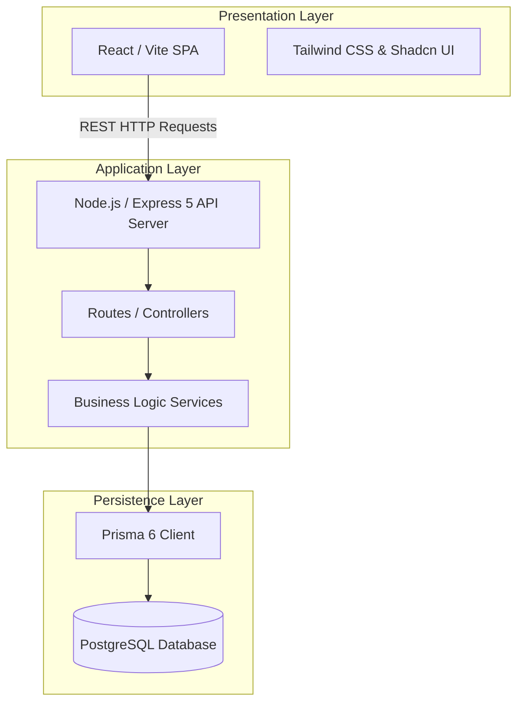

# Lens Web — System Architecture

This document details the system architecture and architectural boundaries of the Lens Web application.

## 1. Architectural Overview

Lens Web is built on a standard three-tier architecture:

---

## 2. Key Modules & Interactions

### A. Procurement & Inventory Inward
* **Manual Inward Wizard:** Pre-calculates range specifications using increment cartesian logic. Generates lists grouped by Lens Coating, with quantity splits allocated to physical locations and trays.
* **PO Inward:** Receives purchase orders and allocates physical items into `TrayMaster` bins. Live tray occupancy is calculated client-side to dynamically prevent tray capacity overflows. Tray occupancy excludes RX-sourced stock (see note below).
* **Inward Queue filtering:** `getInventoryInwardQueue` only lists receipts for **stock-type** POs — direct POs (`saleOrderId` null) and POs raised from a `STOCK`-type Sale Order. Receipts for POs raised from an `RX`-type Sale Order are excluded (RX stock is auto-inwarded via Issue Stock FIFO). PO receive UI uses the same rule: `isStockPO = !po.saleOrderId || po.saleOrder?.procurementType === 'STOCK'`.
* **Tray-to-tray TRANSFER:** Same-location transfers are allowed when source and destination trays differ. Full transfer relocates the existing `InventoryItem`; partial transfer decrements source quantity and creates a new item at the destination. Both source and destination `InventoryStock` buckets update inside the same Prisma transaction client.
* **DB Entry:** Uses bulk-inserts and updates database records inside atomic database transactions via Prisma `$transaction`.
* **RX-sourced stock exclusion:** An `InventoryItem` is "RX-sourced" (earmarked/reserved) iff its `purchaseOrder.saleOrderId` is non-null AND the linked `saleOrder.procurementType === 'RX'`. Items and receipts linked to a `STOCK`-type Sale Order are treated as general/resellable stock. The Stock Summary List/pivot and the Initialize Stock Grid's tray-capacity check exclude RX-sourced stock so these surfaces reflect general/resellable inventory only. FIFO picking, low-stock alerts, and the `InventoryStock` bucket table are unaffected — they continue to reflect true total physical stock including RX-sourced items.
* **Stock Summary Expandable List power grain:** List aggregation (`getInventoryStockWithGrouping`) splits rows by effective SPH/CYL/ADD using the same coalesce as Pivot (`rightX || leftX || '0'`), returns flat `sph`/`cyl`/`add`, and the Lens Product cell renders compact power text via `formatItemPowerRange`. List SPH/CYL/ADD filters use pivot-equivalent OR matching. `InventoryStock` bucket schema remains product/location-level (not power-level).

### B. Sales & FIFO Stock Picking
* **Sale Order Queue:** Aggregates orders ready for QC/issue. Queue load runs **in-memory FIFO soft allocation** (oldest SO first via `softAllocationHelper` / `computeQueueSoftAllocation`): shared matching units are claimed per eye so later SOs show Out of Stock when scarce; API returns `softReservedQty`, `shortageRight` / `shortageLeft`, and soft-aware `isStockAvailable`. Soft claims do **not** write `InventoryStock.reservedStock` or flip item status. Inventory Dashboard Reserved card uses the same `softReservedQty` (merged in `inventoryController` alongside hard `reservedItems`).
* **Stock Allocation:** Performs a FIFO-matching inventory lookup using `getMatchingInventoryFIFO` to identify physical available items, **plus** pending `PurchaseOrderReceipt` rows (Inward Queue) whose spec matches the Sale Order — returned as a single list prefixed `inv_`/`rec_` to disambiguate the two sources. Match scope includes items/POs with no linked SO, items/POs linked to a `STOCK`-type SO (general stock pickable by any order), and items/POs linked to the current SO (RX reserved for that order only). For SPH / CYL / ADD, `null` / empty are treated as `0` at match time; an effective zero also matches SQL `NULL` on the inventory/PO column (Axis / Dia unchanged). Default `applySoftClaims: true` filters out units already soft-claimed by earlier waiting SOs (no double-claim on Issue).
* **Shortage Raise PO:** `raisePoFromSo` defaults PO eyes/qty to uncovered eyes from soft allocation; optional `rightEye` / `leftEye` overrides let the user procure Left, Right, or both before confirm.
* **Auto-Inward-on-Issue:** When `issueToPreQc` receives a `rec_<id>` selection, it auto-inwards that receipt's pending qty into a new `InventoryItem` (default Location/Tray) inside the same `prisma.$transaction` — creating the matching `InventoryTransaction` (`INWARD_PO`) and updating the `InventoryStock` bucket via `generateTransactionNumber(tx)`/`updateInventoryStock(..., tx)` before reserving — so the item is fully accounted for in Stock Summary, not just materialized as an orphan row.
* **Status Updates:** Invokes `reserveInventoryForSale` which performs a quantity-aware item status flip (available -> reserved) and writes to `InventoryTransaction` inside transaction scopes. Hard reserve remains **only** on Issue & Pre-QC.
* **Reservation Consumption:** When a sale order transitions to a finalized state (`DISPATCHED`, `DELIVERED`, `INVOICED`, or `COMPLETED`), the reserved inventory items are consumed (soft-deleted with `deleteStatus: true`) and decremented from `totalStock` and `reservedStock` in the summary table.
* **Reservation Reversion:** When a sale order is reset back to `DRAFT` from a rejected or scrapped state, the reserved inventory items are reverted back to `AVAILABLE` status with quantity restored to `1`, and the stock summary counts are adjusted back from `reservedStock` to `availableStock` (unreserved).

### C. Financial Ledgers
* **Chart of Accounts (COA):** Three-level Tally-style hierarchy — **Primary Group → Account Group → Posting Ledger**. `AccountGroup` classifies ledgers for Balance Sheet sections and P&L (Direct/Indirect income/expense via `pnlClassification`).
* **Control ledgers:** System codes `AC-1003` (Sundry Debtors) and `AC-2001` (Sundry Creditors) are group control ledgers (`isGroupLedger`, `allowsDirectPosting: false`); all AR/AP postings go to customer/vendor sub-ledgers.
* **Double-Entry Postings:** Transactions write debit/credit lines into posting ledgers; `postTransaction()` rejects non-posting control ledgers (`NON_POSTING_LEDGER`).
* **Cash/Bank picker:** `getCashBankLedgers()` filters by account groups `GRP-CASH` / `GRP-BANK` (not all ASSET ledgers).
* **Reporting:** Group Summary (recursive rollup), grouped Balance Sheet, P&L by account group classification; ledger statement rows include payment allocation breakdown for RECEIPT/PAYMENT transactions.
* **Payment traceability:** Customer/vendor payment history and detail views show expandable breakdown trees with navigation to Billing invoice detail or PO view.
* **Billing Tax Invoice (2026-07-14):** Preview/print HTML matches M.V.V Tax Invoice layout (`buildInvoiceHtml` / `printInvoice`); line **Ref No.** = `SaleOrder.customerRefNo`; seller extras (PAN, state code, bank/IFSC) from `CompanySettings.customAttributes` when set.
* **Invoice due date:** `Invoice.dueDate` = invoice date + `Customer.credit_days` when client omits override.
* **Payment UX:** Vendor/Customer Payment History are multi-column registers; Record Payment and New Payment both select via Outstanding PO/Invoice List UI. Vendor payment GST % from Company Settings (`getGstRatesFromSettings`); tax amount = base × %.
* **Expenses:** Category from Expense Category (type auto-fills); optional `Expense.dueDate`; Payment Account from `getCashBankLedgers()` (service returns array — do not check `.success` on client).

---

## 3. Transaction Threading & Concurrency

To prevent race conditions and inventory mismatches:
* All database lookups and updates within an allocation or reservation pipeline must accept a `dbClient` (Prisma Transaction Client) parameter.
* Database operations are executed inside `prisma.$transaction(...)` contexts, allowing rollbacks if any individual item allocation fails.
