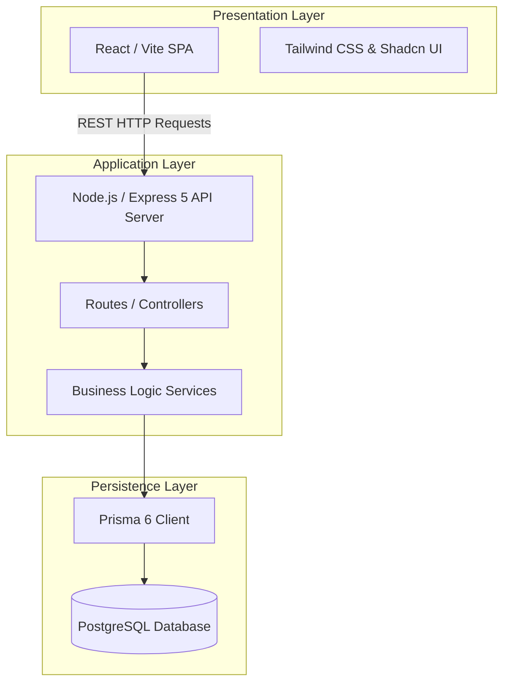

# Lens Web — System Architecture

This document details the system architecture and architectural boundaries of the Lens Web application.

## 1. Architectural Overview

Lens Web is built on a standard three-tier architecture:

---

## 2. Key Modules & Interactions

### A. Procurement & Inventory Inward
* **Manual Inward Wizard:** Pre-calculates range specifications using increment cartesian logic. Generates lists grouped by Lens Coating, with quantity splits allocated to physical locations and trays.
* **PO Inward:** Receives purchase orders and allocates physical items into `TrayMaster` bins. Live tray occupancy is calculated client-side to dynamically prevent tray capacity overflows.
* **DB Entry:** Uses bulk-inserts and updates database records inside atomic database transactions via Prisma `$transaction`.

### B. Sales & FIFO Stock Picking
* **Sale Order Queue:** Aggregates orders ready for QC/issue.
* **Stock Allocation:** Performs a FIFO-matching inventory lookup using `getMatchingInventoryFIFO` to identify physical available items, **plus** pending `PurchaseOrderReceipt` rows (Inward Queue) whose spec matches the Sale Order — returned as a single list prefixed `inv_`/`rec_` to disambiguate the two sources.
* **Auto-Inward-on-Issue:** When `issueToPreQc` receives a `rec_<id>` selection, it auto-inwards that receipt's pending qty into a new `InventoryItem` (default Location/Tray) inside the same `prisma.$transaction` — creating the matching `InventoryTransaction` (`INWARD_PO`) and updating the `InventoryStock` bucket via `generateTransactionNumber(tx)`/`updateInventoryStock(..., tx)` before reserving — so the item is fully accounted for in Stock Summary, not just materialized as an orphan row.
* **Status Updates:** Invokes `reserveInventoryForSale` which performs a quantity-aware item status flip (available -> reserved) and writes to `InventoryTransaction` inside transaction scopes.

### C. Financial Ledgers
* **Chart of Accounts (COA):** Holds assets, liabilities, income, and expenses.
* **Double-Entry Postings:** Transactions write debit/credit lines into `Ledger` to ensure balanced sheets. 
* **P&L Reporting:** Filters ledgers by direct/indirect categories to generate revenue/cost reports.

---

## 3. Transaction Threading & Concurrency

To prevent race conditions and inventory mismatches:
* All database lookups and updates within an allocation or reservation pipeline must accept a `dbClient` (Prisma Transaction Client) parameter.
* Database operations are executed inside `prisma.$transaction(...)` contexts, allowing rollbacks if any individual item allocation fails.
