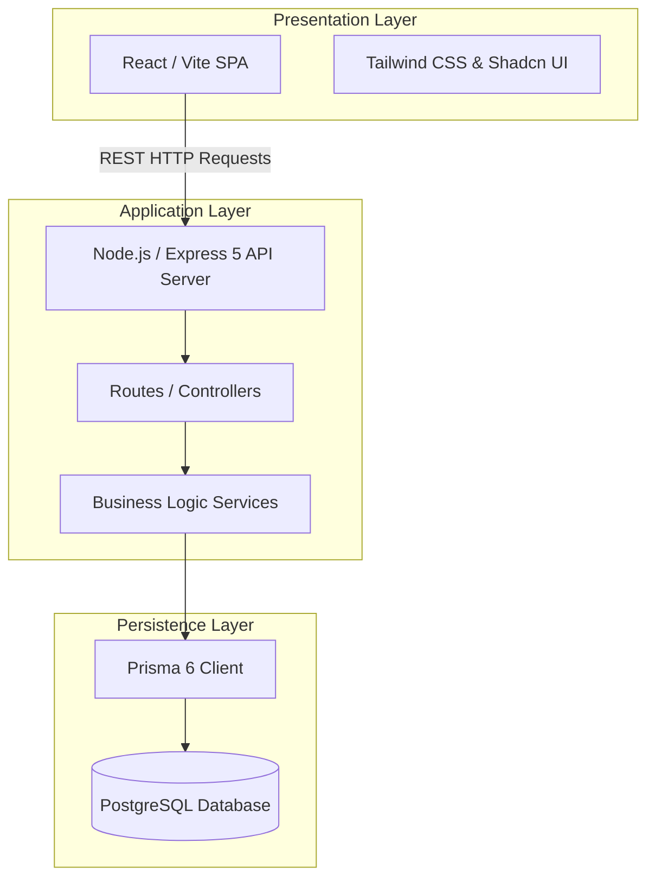

# Lens Web — System Architecture

This document details the system architecture and architectural boundaries of the Lens Web application.

## 1. Architectural Overview

Lens Web is built on a standard three-tier architecture:

---

## 2. Key Modules & Interactions

### A. Procurement & Inventory Inward
* **Manual Inward Wizard:** Pre-calculates range specifications using increment cartesian logic. Generates lists grouped by Lens Coating, with quantity splits allocated to physical locations and trays.
* **PO Inward:** Receives purchase orders and allocates physical items into `TrayMaster` bins. Live tray occupancy is calculated client-side to dynamically prevent tray capacity overflows. Tray occupancy excludes RX-sourced stock (see note below).
* **DB Entry:** Uses bulk-inserts and updates database records inside atomic database transactions via Prisma `$transaction`.
* **RX-sourced stock exclusion:** An `InventoryItem` is "RX-sourced" iff its `purchaseOrder.saleOrderId` is non-null (procured specifically for one customer's Sale Order, vs. general stock-type procurement). The Stock Summary List/pivot and the Initialize Stock Grid's tray-capacity check exclude RX-sourced stock so these surfaces reflect general/resellable inventory only. FIFO picking, low-stock alerts, and the `InventoryStock` bucket table are unaffected — they continue to reflect true total physical stock including RX-sourced items.

### B. Sales & FIFO Stock Picking
* **Sale Order Queue:** Aggregates orders ready for QC/issue.
* **Stock Allocation:** Performs a FIFO-matching inventory lookup using `getMatchingInventoryFIFO` to identify physical available items, **plus** pending `PurchaseOrderReceipt` rows (Inward Queue) whose spec matches the Sale Order — returned as a single list prefixed `inv_`/`rec_` to disambiguate the two sources.
* **Auto-Inward-on-Issue:** When `issueToPreQc` receives a `rec_<id>` selection, it auto-inwards that receipt's pending qty into a new `InventoryItem` (default Location/Tray) inside the same `prisma.$transaction` — creating the matching `InventoryTransaction` (`INWARD_PO`) and updating the `InventoryStock` bucket via `generateTransactionNumber(tx)`/`updateInventoryStock(..., tx)` before reserving — so the item is fully accounted for in Stock Summary, not just materialized as an orphan row.
* **Status Updates:** Invokes `reserveInventoryForSale` which performs a quantity-aware item status flip (available -> reserved) and writes to `InventoryTransaction` inside transaction scopes.

### C. Financial Ledgers
* **Chart of Accounts (COA):** Three-level Tally-style hierarchy — **Primary Group → Account Group → Posting Ledger**. `AccountGroup` classifies ledgers for Balance Sheet sections and P&L (Direct/Indirect income/expense via `pnlClassification`).
* **Control ledgers:** System codes `AC-1003` (Sundry Debtors) and `AC-2001` (Sundry Creditors) are group control ledgers (`isGroupLedger`, `allowsDirectPosting: false`); all AR/AP postings go to customer/vendor sub-ledgers.
* **Double-Entry Postings:** Transactions write debit/credit lines into posting ledgers; `postTransaction()` rejects non-posting control ledgers (`NON_POSTING_LEDGER`).
* **Cash/Bank picker:** `getCashBankLedgers()` filters by account groups `GRP-CASH` / `GRP-BANK` (not all ASSET ledgers).
* **Reporting:** Group Summary (recursive rollup), grouped Balance Sheet, P&L by account group classification; ledger statement rows include payment allocation breakdown for RECEIPT/PAYMENT transactions.
* **Payment traceability:** Customer/vendor payment history and detail views show expandable breakdown trees with navigation to Billing invoice detail or PO view.

---

## 3. Transaction Threading & Concurrency

To prevent race conditions and inventory mismatches:
* All database lookups and updates within an allocation or reservation pipeline must accept a `dbClient` (Prisma Transaction Client) parameter.
* Database operations are executed inside `prisma.$transaction(...)` contexts, allowing rollbacks if any individual item allocation fails.
