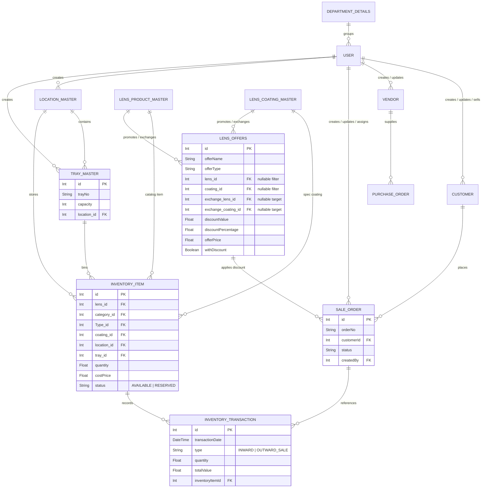

# Lens Web — Database ERD

This document details the database schema, models, and entity relationships of the Lens Web application.

## Entity Relationship Diagram


```

---

## Core Entities Description

### 1. InventoryItem
Stores physical stock rows. Note that a single row can hold multiple units of identical specs (Sph, Cyl, Add, Coating, etc.) in a specific Tray and Location. Status flips to `RESERVED` when quantity is consumed by a Sale Order.

### 2. InventoryTransaction
Records all inward movements (Manual or PO Inward) and outward movements (Sale Order dispatch). Keeps track of historical unit prices and values.

### 3. LocationMaster & TrayMaster
Represents the physical organization. A Location (warehouse/room) contains multiple Trays (bins). Each Tray has a max capacity limit.

### 4. SaleOrder
Represents sales orders placed by Customers. Triggers stock reservations via `reserveInventoryForSale()` during the Pre-QC workflow transition.

### 5. Customer
Represents customer accounts. Tracks credit limits and exposure dynamically using `credit_limit`, `outstanding_credit`, and the new `reserved_amount` field (which stores reserved amounts for active/uninvoiced Sale Orders).
