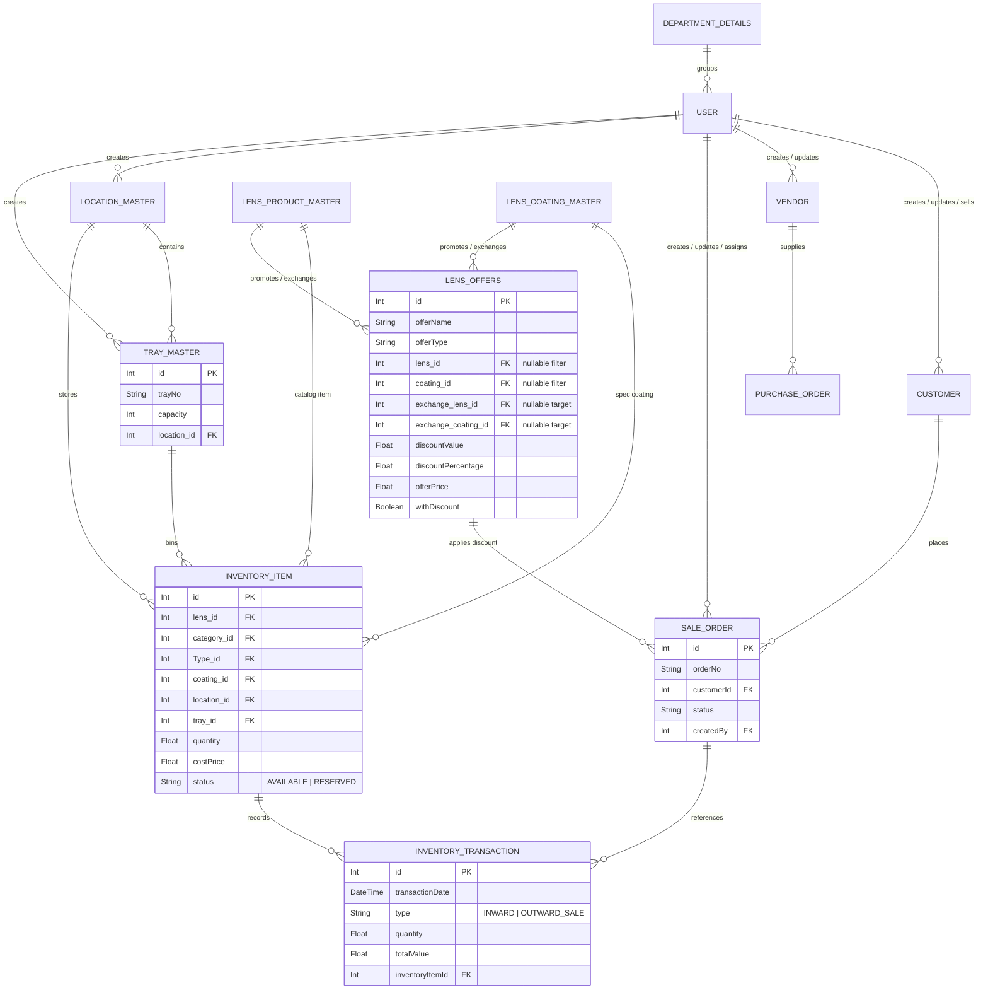

# Lens Web — Database ERD

This document details the database schema, models, and entity relationships of the Lens Web application.

## Entity Relationship Diagram


```mermaid
erDiagram
    USER ||--o{ CUSTOMER : "creates / updates / sells"
    USER ||--o{ VENDOR : "creates / updates"
    USER ||--o{ SALE_ORDER : "creates / updates / assigns"
    USER ||--o{ LOCATION_MASTER : "creates"
    USER ||--o{ TRAY_MASTER : "creates"

    DEPARTMENT_DETAILS ||--o{ USER : "groups"

    LOCATION_MASTER ||--o{ TRAY_MASTER : "contains"
    LOCATION_MASTER ||--o{ INVENTORY_ITEM : "stores"
    TRAY_MASTER ||--o{ INVENTORY_ITEM : "bins"

    LENS_PRODUCT_MASTER ||--o{ INVENTORY_ITEM : "catalog item"
    LENS_COATING_MASTER ||--o{ INVENTORY_ITEM : "spec coating"

    CUSTOMER ||--o{ SALE_ORDER : "places"
    VENDOR ||--o{ PURCHASE_ORDER : "supplies"

    INVENTORY_ITEM ||--o{ INVENTORY_TRANSACTION : "records"
    SALE_ORDER ||--o{ INVENTORY_TRANSACTION : "references"

    INVENTORY_ITEM {
        Int id PK
        Int lens_id FK
        Int category_id FK
        Int Type_id FK
        Int coating_id FK
        Int location_id FK
        Int tray_id FK
        Float quantity
        Float costPrice
        String status "AVAILABLE | RESERVED"
    }

    INVENTORY_TRANSACTION {
        Int id PK
        DateTime transactionDate
        String type "INWARD | OUTWARD_SALE"
        Float quantity
        Float totalValue
        Int inventoryItemId FK
    }

    TRAY_MASTER {
        Int id PK
        String trayNo
        Int capacity
        Int location_id FK
    }

    SALE_ORDER {
        Int id PK
        String orderNo
        Int customerId FK
        String status
        Int createdBy FK
    }

    LENS_PRODUCT_MASTER ||--o{ LENS_OFFERS : "promotes / exchanges"
    LENS_COATING_MASTER ||--o{ LENS_OFFERS : "promotes / exchanges"
    LENS_OFFERS ||--o{ SALE_ORDER : "applies discount"

    LENS_OFFERS {
        Int id PK
        String offerName
        String offerType
        Int lens_id FK "nullable filter"
        Int coating_id FK "nullable filter"
        Int exchange_lens_id FK "nullable target"
        Int exchange_coating_id FK "nullable target"
        Float discountValue
        Float discountPercentage
        Float offerPrice
        Boolean withDiscount
    }
```
```

---

## Core Entities Description

### 1. InventoryItem
Stores physical stock rows. Note that a single row can hold multiple units of identical specs (Sph, Cyl, Add, Coating, etc.) in a specific Tray and Location. Status flips to `RESERVED` when quantity is consumed by a Sale Order. **Per-eye QC (2026-07-26):** `issuedEye` (`IssuedEyeSide` RIGHT|LEFT, nullable) attributes a reserved unit to one SO eye; `isReused` (Boolean, default false) is the persistent REUSED tag after Inward Queue Reuse (location+tray required). Status `RETURNED` = pending Dispose/Reuse. **Reuse (2026-07-27):** on REUSE the row is canonicalized to one eye’s SPH/CYL/ADD + matching `rightEye`/`leftEye` flags (opposite optical fields cleared) so Stock Summary power buckets match the returned lens. **Partial reserve (2026-07-27):** reserving part of an AVAILABLE multi-qty row creates child `RESERVED` rows (`quantity: 0`, `saleOrderId` + `issuedEye`) while the source remains AVAILABLE with decremented qty.

### 1b. InventoryQcReturn
Pending QC reject returns shown in Inward Queue. Fields include `saleOrderId`, optional `inventoryItemId`, `sourceStatus`, `rejectRemark`, `status` (PENDING|REUSED|DISPOSED), and **`eyeSide`** (`IssuedEyeSide?`, required on new rows). Scrap rejects do **not** create rows. Queue listing filters by `saleOrder.procurementType` (RX vs STOCK godown), not item location godown.

### 2. InventoryTransaction
Records all inward movements (Manual or PO Inward) and outward movements (Sale Order dispatch). Keeps track of historical unit prices and values.

### 3. LocationMaster & TrayMaster
Represents the physical organization. A Location (warehouse/room) contains multiple Trays (bins). Each Tray has a max capacity limit.

### 4. SaleOrder
Represents sales orders placed by Customers. Triggers stock reservations via `reserveInventoryForSale()` during the Pre-QC workflow transition.

### 5. Customer
Represents customer accounts. Tracks credit limits and exposure dynamically using `credit_limit`, `outstanding_credit`, `reserved_amount` (uninvoiced SO exposure), **`advance_credit`** (prepaid balance from customer payment vouchers with `advanceAmount > 0`, added 2026-07-05), and **`credit_days`** (integer payment terms; invoice `dueDate` = invoice date + credit days when not overridden, added 2026-07-14).

### 6. Customer Payment Voucher (2026-07-05; cancel 2026-07-25)
Header table for consolidated customer receipts. One voucher → one `FinancialTransaction` (`RECEIPT`). Lines in `CustomerPaymentVoucherItem` allocate amounts to invoices; subsidiary `Payment` rows link via `Payment.voucherId`. **`cancelledStatus` / `cancelledAt`** — cancel posts reversing txn and restores allocations; blocked if original FT `isReconciled`.

```
CustomerPaymentVoucher ||--o{ CustomerPaymentVoucherItem : "allocates"
CustomerPaymentVoucher }o--|| Customer : "belongs to"
CustomerPaymentVoucherItem }o--|| Invoice : "clears"
Payment }o--o| CustomerPaymentVoucher : "voucherId"
```

### 7. Vendor Payment Voucher & Vendor Invoice
Invoice-first payables (2026-07): `VendorInvoice` / `VendorInvoiceItem` link supplier invoices to POs; `VendorPaymentVoucherItem.vendorInvoiceId` allocates payments. **`cancelledStatus` / `cancelledAt`** on vouchers (2026-07-25). Eligible-PO query excludes POs already on a non-cancelled Vendor Invoice.

### 8. Account Groups & Ledger Classification (2026-07-05)

Industry COA hierarchy for Balance Sheet and P&L reporting.

```
AccountGroup ||--o{ AccountGroup : "parentGroupId (self-relation)"
AccountGroup ||--o{ Ledger : "accountGroupId"
Ledger ||--o{ Ledger : "parentLedgerId (AR/AP sub-ledgers)"
```

**`AccountGroup`** — `groupCode` (unique), `groupName`, `nature` (`LedgerType`), `parentGroupId`, `reportSection` (`BALANCE_SHEET` | `PROFIT_LOSS` | `NONE`), `pnlClassification` (`DIRECT_EXPENSE`, `INDIRECT_EXPENSE`, etc.), `isSystemGroup`, `sortOrder`.

**`Ledger` extensions:**
- `accountGroupId` — links posting ledger to its account group
- `isGroupLedger` — true for control ledgers (AC-1003, AC-2001)
- `allowsDirectPosting` — false blocks manual/auto posting to control ledgers

**Seeded groups (19):** Assets → Current Assets → Cash-in-Hand, Bank Accounts, Sundry Debtors, Inventory, GST Input; Liabilities → Current Liabilities → Sundry Creditors, GST Output, TDS; Capital; Income/Expense Direct & Indirect sub-groups.

**Seed script:** `node prisma/seed/account-groups-seed.js` (run after migration `20260705140000_account_groups`).

**Customer/vendor sub-ledgers** (`AC-1003-C*`, `AC-2001-V*`) inherit `accountGroupId` from Sundry Debtors / Sundry Creditors on create.

### 9. Expense (2026-07-14)
`Expense.dueDate` (`DateTime?`) stores optional payment due date distinct from `expenseDate`. Category still drives DIRECT/INDIRECT via `ExpenseCategory.expenseType`.

### 10. Income & Income Category (2026-07-25; From/To follow-up)
Mirrors Expense: `IncomeCategory` + `Income`. Create requires `fromLedgerId` + `toLedgerId` (Cash/Bank/Capital posting ledgers). Posting **Dr To, Cr From**. Legacy `bankLedgerId` optional/nullable after migration `20260725100000_income_from_to_ledgers`.

### 11. Credit / Debit Notes behavior (2026-07-25)
UI: Customer **Credit Note** only; Vendor **Debit Note** only (create of Customer DN / Vendor CN rejected). New Customer CN / Vendor DN are document-only (no party AR/AP FT). Historical other note types remain in DB.
