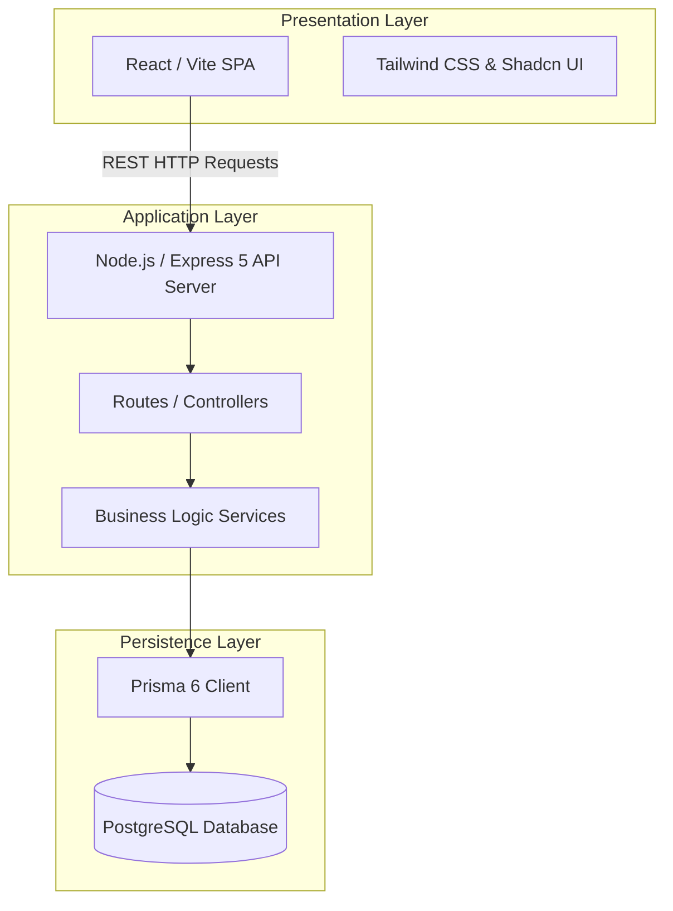

---
v: 1
sections:
  - id: DD-1.1
    title: Architecture overview
  - id: DD-2.1
    title: Financial accounting surfaces
---

# Lens Web — System Architecture

This document details the system architecture and architectural boundaries of the Lens Web application.

## 1. Architectural Overview

Lens Web is built on a standard three-tier architecture:

---

## 2. Key Modules & Interactions

### A. Procurement & Inventory Inward
* **Manual Inward Wizard:** Pre-calculates range specifications using increment cartesian logic. Generates lists grouped by Lens Coating, with quantity splits allocated to physical locations and trays.
* **PO Inward:** Receives purchase orders and allocates physical items into `TrayMaster` bins. Live tray occupancy is calculated client-side to dynamically prevent tray capacity overflows. Tray occupancy excludes RX-sourced stock (see note below).
* **Inward Queue filtering:** `getInventoryInwardQueue` only lists receipts for **stock-type** POs — direct POs (`saleOrderId` null) and POs raised from a `STOCK`-type Sale Order. Receipts for POs raised from an `RX`-type Sale Order are excluded (RX stock is auto-inwarded via Issue Stock FIFO). PO receive UI uses the same rule: `isStockPO = !po.saleOrderId || po.saleOrder?.procurementType === 'STOCK'`. **QC returns (2026-07-26):** pending `InventoryQcReturn` rows are filtered by `saleOrder.procurementType` only (RX godown queue ↔ RX SOs; Stock ↔ STOCK SOs) — not by item location `godownType`. Scrap rejects never create QcReturn rows.
* **Tray-to-tray TRANSFER:** Same-location transfers are allowed when source and destination trays differ. Full transfer relocates the existing `InventoryItem`; partial transfer decrements source quantity and creates a new item at the destination. Both source and destination `InventoryStock` buckets update inside the same Prisma transaction client.
* **DB Entry:** Uses bulk-inserts and updates database records inside atomic database transactions via Prisma `$transaction`.
* **RX-sourced stock exclusion:** An `InventoryItem` is "RX-sourced" (earmarked/reserved) iff its `purchaseOrder.saleOrderId` is non-null AND the linked `saleOrder.procurementType === 'RX'`. Items and receipts linked to a `STOCK`-type Sale Order are treated as general/resellable stock. The Stock Summary List/pivot and the Initialize Stock Grid's tray-capacity check exclude RX-sourced stock so these surfaces reflect general/resellable inventory only. FIFO picking, low-stock alerts, and the `InventoryStock` bucket table are unaffected — they continue to reflect true total physical stock including RX-sourced items.
* **Stock Summary grouping (2026-07-26 / power eye-awareness 2026-07-27):** List aggregation (`getInventoryStockWithGrouping`) keys by `lens_id|coating_id|location_id|tray_id|normalizedSph|normalizedCyl|normalizedAdd` (no `Type_id`/`category_id` splitters). Pivot (`getInventoryStockPivot`) keys by `lens_id|coating_id|normalizedSph|normalizedCyl|normalizedAdd` (no `lensType.id`). Shared `coalescePower`: left-only → left powers (fallback right if left empty); right-only → right (fallback left); else legacy `right || left`. `normalizePowerValue` treats null/empty as `0` with `toFixed(2)` so `"0"` ≡ `"0.00"`. Rows still return flat `sph`/`cyl`/`add` and compact power via `formatItemPowerRange`. List SPH/CYL/ADD filters use pivot-equivalent OR matching. `InventoryStock` bucket schema remains product/location-level (not power-level).
* **Inventory Audit tab (req-013, 2026-08-31):** `/inventory/{stock|rx}/audit` — Manual Add Stock (`INWARD_DIRECT` single spec), Initialize Stock (bulk grid via `POST /items/bulk-grid` alias), Spec Threshold editor. Godown-scoped dropdowns identical to other inventory tabs. Initialize Stock removed from Dashboard.
* **Spec-level stock thresholds (req-013):** `InventorySpecThreshold` rows keyed by `lens_id + godownType + sph/cyl/add` (normalized). `specQty` = sum `InventoryItem.quantity` grouped by lens + coalescePower within `inventoryItemGodownWhere`. Alerts computed at read time (no `InventoryAlert` writes): OUT (threshold exists, qty 0), LOW (qty > 0 and < min), OVER (max set and qty > max). Dashboard KPIs use same engine as `GET /spec-alerts`. Product-level `LensProductMaster.minThresholdQty`/`maxThresholdQty` no longer drive dashboard KPIs.
* **Inventory Dashboard (req-013):** Six KPI cards (Total Products, Total Stock units, Total Value, Low, Out, Over). Clickable Low/Out/Over toggles spec alert list; deselect shows inward/outward quantity trend. Top 10 / Least 10 selling products retained (godown-scoped). Display binds `specQty`/`totalStockUnits` — never `currentQty`.

### B. Sales & FIFO Stock Picking
* **Sale Order Queue:** Aggregates orders ready for QC/issue. Queue load runs **in-memory FIFO soft allocation** (oldest SO first via `softAllocationHelper` / `computeQueueSoftAllocation`): shared matching units are claimed per eye so later SOs show Out of Stock when scarce; API returns `softReservedQty`, `shortageRight` / `shortageLeft`, and soft-aware `isStockAvailable`. Soft claims do **not** write `InventoryStock.reservedStock` or flip item status. Inventory Dashboard Reserved card uses the same `softReservedQty` (merged in `inventoryController` alongside hard `reservedItems`).
* **Stock Allocation:** Performs a FIFO-matching inventory lookup using `getMatchingInventoryFIFO` to identify physical available items, **plus** pending `PurchaseOrderReceipt` rows (Inward Queue) whose spec matches the Sale Order — returned as a single list prefixed `inv_`/`rec_` to disambiguate the two sources. Match scope includes items/POs with no linked SO, items/POs linked to a `STOCK`-type SO (general stock pickable by any order), and items/POs linked to the current SO (RX reserved for that order only). For SPH / CYL / ADD, `null` / empty are treated as `0` at match time; an effective zero also matches SQL `NULL` on the inventory/PO column (Axis / Dia unchanged). Default `applySoftClaims: true` filters out units already soft-claimed by earlier waiting SOs (no double-claim on Issue).
* **Shortage Raise PO:** `raisePoFromSo` defaults PO eyes/qty to uncovered eyes from soft allocation; optional `rightEye` / `leftEye` overrides let the user procure Left, Right, or both before confirm. After partial per-eye QC reject, an accepted reserved eye counts as covered — defaults are missing/rejected eyes only. SO status gate remains `DRAFT` | `PO_CANCELLED`. **In-flight PO gate (2026-07-26):** `PO_EXISTS` only when a linked PO is `DRAFT` or `PO_PARTIAL_RECEIVED` (`IN_FLIGHT_PO_STATUSES`). A prior fully `RECEIVED` PO does not block Rx re-raise after QC reject → Confirm Reset → Draft. `ACTIVE_PO_STATUSES` (includes `RECEIVED`) remains for cancel-SO and related flows.
* **Per-eye QC reject / reprocess (2026-07-26):** Reject/scrap payloads include `rejectedEyes: { rightEye, leftEye }`. Only items whose `InventoryItem.issuedEye` is in the rejected set are released. Reusable → `RETURNED` + PENDING `InventoryQcReturn` (`eyeSide`); scrap → immediate `DAMAGED` / write-off (no queue). Accepted eyes stay SO-linked through Confirm Reset → `DRAFT`. `issueToPreQc` stamps `issuedEye` on reserve (one unit per eye); `getIssueEyeReadiness` drives Stock Pick **Issue stock** vs **Already has lens**; picks required only for eyes needing issue. One-eye reject on an unstamped dual-eye reserved row fails closed (`PARTIAL_REJECT_UNSTAMPED_PAIR`).
* **Auto-Inward-on-Issue:** When `issueToPreQc` receives a `rec_<id>` selection, it auto-inwards that receipt's pending qty into a new `InventoryItem` (default Location/Tray) inside the same `prisma.$transaction` — creating the matching `InventoryTransaction` (`INWARD_PO`) and updating the `InventoryStock` bucket via `generateTransactionNumber(tx)`/`updateInventoryStock(..., tx)` before reserving — so the item is fully accounted for in Stock Summary, not just materialized as an orphan row. **(2026-07-27)** New unit stamps only the `issuedEye` powers/flags from the SO (not the full L+R pair).
* **Reuse optical canonicalize (2026-07-27):** `dispositionQcReturn` REUSE resolves eye from QcReturn `eyeSide` (fallback `issuedEye`), rewrites the item to that single-eye identity (FIFO left cross-match: copy right→left when left optical empty), clears the opposite eye, then AVAILABLE / location / tray / `isReused`.
* **Status Updates:** Invokes `reserveInventoryForSale` which performs a quantity-aware reserve inside transaction scopes. Hard reserve remains **only** on Issue & Pre-QC. **(2026-07-27)** Full consume flips the source row to `RESERVED` + SO link + optional `issuedEye`. Partial consume decrements the source (stays `AVAILABLE`, FIFO-visible) and creates one SO-linked `RESERVED` child per unit (`quantity: 0`, `issuedEye` when provided); `OUTWARD_SALE` references the child; `InventoryStock` RESERVE updates once against the source bucket identity.
* **Reservation Consumption:** When a sale order transitions to a finalized state (`DISPATCHED`, `DELIVERED`, `INVOICED`, or `COMPLETED`), the reserved inventory items are consumed (soft-deleted with `deleteStatus: true`) and decremented from `totalStock` and `reservedStock` in the summary table.
* **Reservation Reversion:** Confirm Reset → `DRAFT` after QC reject/scrap does **not** unreserve accepted-eye items that remain linked to the SO after a partial reject. Only wrongly reserved / released eyes return to Available; `OUTWARD_SALE` cleanup is limited to released eyes. Full both-eye reject still leaves no accepted reserved stock.

### C. Financial Ledgers
* **Chart of Accounts (COA):** Three-level Tally-style hierarchy — **Primary Group → Account Group → Posting Ledger**. `AccountGroup` classifies ledgers for Balance Sheet sections and P&L (Direct/Indirect income/expense via `pnlClassification`).
* **Control ledgers:** System codes `AC-1003` (Sundry Debtors) and `AC-2001` (Sundry Creditors) are group control ledgers (`isGroupLedger`, `allowsDirectPosting: false`); all AR/AP postings go to customer/vendor sub-ledgers.
* **Double-Entry Postings:** Transactions write debit/credit lines into posting ledgers; `postTransaction()` rejects non-posting control ledgers (`NON_POSTING_LEDGER`).
* **Cash/Bank picker:** `getCashBankLedgers()` filters by account groups `GRP-CASH` / `GRP-BANK` (not all ASSET ledgers).
* **Reporting:** Group Summary (recursive rollup), grouped Balance Sheet, P&L by account group classification; ledger statement rows include payment allocation breakdown for RECEIPT/PAYMENT transactions.
* **Payment traceability:** Customer/vendor payment history and detail views show expandable breakdown trees with navigation to Billing invoice detail or PO view.
* **Billing Tax Invoice (2026-07-14):** Preview/print HTML matches M.V.V Tax Invoice layout (`buildInvoiceHtml` / `printInvoice`); line **Ref No.** = `SaleOrder.customerRefNo`; seller extras (PAN, state code, bank/IFSC) from `CompanySettings.customAttributes` when set.
* **Invoice due date:** `Invoice.dueDate` = invoice date + `Customer.credit_days` when client omits override.
* **Payment UX:** Vendor payments are **invoice-first** (`POST /api/vendor-payments/from-invoices`); Record Payment opens in-page dialog on Vendor Payments hub (tab-aware header CTA on Vendor Bills tab); legacy `/record-payment` route redirects to hub. Customer/Vendor Payment History are multi-column registers. Cancel payment reverses FT via `postReversingTransaction` and restores allocations (blocked if reconciled). Vendor payment GST % from Company Settings when registering invoices.
* **Vendor Invoice create:** Eligible PO list excludes POs already linked to a non-cancelled `VendorInvoice`. **GL accrual (req-014):** `postVendorInvoice` on bill registration — Dr AC-1004 (+ AC-1005 if tax), Cr vendor AP; `referenceType: VENDOR_INVOICE`. PO receipt is ops-only (no `postPurchaseReceipt`). Cancel/update reverse via `postReversingTransaction` when unpaid.
* **Expenses:** Category from Expense Category (type auto-fills); optional `Expense.dueDate`; Payment Account from `getCashBankLedgers()` (service returns array — do not check `.success` on client).
* **Income & Bank Accounts (2026-07-25):** Income vouchers use **From + To** ledgers (Cash / Bank / Capital); posting **Dr To / Cr From**. Bank Account manage CRUD for GRP-CASH/GRP-BANK. Permissions `income`, `income_categories`, `bank_accounts` must stay in `role.constants.js` + `role-seed.js` (KB-026/034). **UI (2026-07-26):** Income From/To labels include `currentBalance` via `formatCashBankLedgerLabel`; dialog data loads independently on open (categories not wiped by ledger failure).
* **Notes:** Customer Payments show **Credit Notes** only; Vendor Payments show **Debit Notes** only. New Customer CN / Vendor DN are document-only (no party AR/AP).
* **Vendor Invoice eligible POs:** Exclude already-invoiced POs (VI item link, or status INVOICE_RECEIVED/PAID, or supplierInvoiceNo set).
* **Billing / DC print:** Goods description specs exclude DIA (`formatEyeSpecs` in `Billing.constants.js`; DC reuses same helper).
* **Dispatch lists:** Ready-for-dispatch and dispatch-copy lists order by `createdAt` descending.

---

### D. Authentication & Session Continuity
* **Tokens:** Access JWT (`JWT_EXPIRES_IN`, default `15m`) + refresh JWT (`REFRESH_TOKEN_EXPIRES_IN`, default `7d`). Refresh string is reused on renew (no sliding refresh). One `RefreshToken` row per device (`User.refreshTokens` 1:n); login **inserts**, never upserts-by-userId. Logout / failed renew delete only the matching token row.
* **DB TTL:** `storeRefreshToken` sets `expiresAt` via `addDuration(REFRESH_TOKEN_EXPIRES_IN)` (`src/backend/utils/duration.js`) so JWT and DB agree when env TTLs change.
* **Frontend renew:** Axios interceptor on 401 silently refreshes (raw `axios.post`, not the interceptor stack), queues concurrent 401s, retries; `/auth/login` and `/auth/refresh` are excluded from the 401→refresh path. Lock always resets via `failRefreshAndForceLogout` on non-success or throw.
* **Proactive renew:** `AuthContext` / `auth.js` schedules refresh ~60s before access `exp`; failure uses the same forced-logout path.
* **Forced logout:** Clear local auth, best-effort `POST /api/auth/logout` with refresh body (public route; works when access is already dead), dispatch `auth:session-expired` → toast + `/login`.

---

## 3. Transaction Threading & Concurrency

To prevent race conditions and inventory mismatches:
* All database lookups and updates within an allocation or reservation pipeline must accept a `dbClient` (Prisma Transaction Client) parameter.
* Database operations are executed inside `prisma.$transaction(...)` contexts, allowing rollbacks if any individual item allocation fails.

## DD-2.1 Financial accounting surfaces

Primary UI paths:
- **Billing and invoicing (shipped 2026-08-27):** `src/pages/Accounting/BillingAndInvoicing/` → `/accounts/billing-and-invoicing`; tab-aware header CTAs (Awaiting→Create Invoice, Invoices→Record Payment, Credit Notes→New Credit Note); Record Payment in-page dialog; legacy `/record-payment` redirects to hub
- Legacy redirects: `/billing`, `/accounts/customer-payments` → merged workspace
- Income: `src/pages/Accounting/Income/` → `/accounts/income` (nav label **Income and loans**; Loan via category filter)
- **Vendor & payments (shipped 2026-08-30):** `src/pages/Accounting/VendorPayments/` → `/accounts/vendor-payments`; Record Payment in-page dialog (header on Vendor Bills tab); legacy `/record-payment` redirects to hub; nav **Vendor & payments**
- Expenses: `src/pages/Accounting/Expenses/` → `/accounts/expenses` (non-vendor overhead only)
- **Finance Dashboard (shipped 2026-08-31):** `src/pages/Accounting/FinanceDashboard/` → `/accounts/finance-dashboard`
- Financial Reports: `src/pages/Accounting/FinancialReports.jsx` → `/accounts/reports`
- **Customer 360 (shipped 2026-08-30):** `src/pages/Accounting/Customer360/` → `/accounts/customer-360`
- Nav: `src/components/layout/AppSidebar.jsx` — Accounting › Finance Dashboard (finance_dashboard key) first, then Billing, Customer 360, Vendor & payments

Key APIs: `/api/invoices` (+ filter-scoped stats), `/api/customer-payments` (+ `applyAdvanceAmount`), `/api/incomes`, `/api/expenses`, `/api/vendor-payments` (+ `/stats`, `/outstanding-invoices` filters), `/api/vendor-indirect-expenses` (+ `/pay`), `/api/accounting/vendor-invoices/awaiting-bills`, `/api/financial-reports/*` (+ `/dashboard`, `/trial-balance-grouped`), `/api/ledgers/cash-bank`, `/api/ledgers/liability-posting`, `/api/customer-360/:customerId/overview`, `/api/customer-360/:customerId/cards/:cardKey`.

Allocation: `src/backend/utils/paymentAllocation.js`. Posting: `src/backend/services/accountingService.js` (+ `postIndirectExpenseAccrual`, `postIndirectExpensePayment`). Indirect expense pay UI: `PayExpenseBillDialog.jsx` (liability account + FIFO). Customer 360 aggregation: `src/backend/services/customer360Service.js` (read-only; reuses invoice/payment/SO/CN/ledger data).

**Target IA (PRD-4.x):** Held: BI (PRD-4.7).

