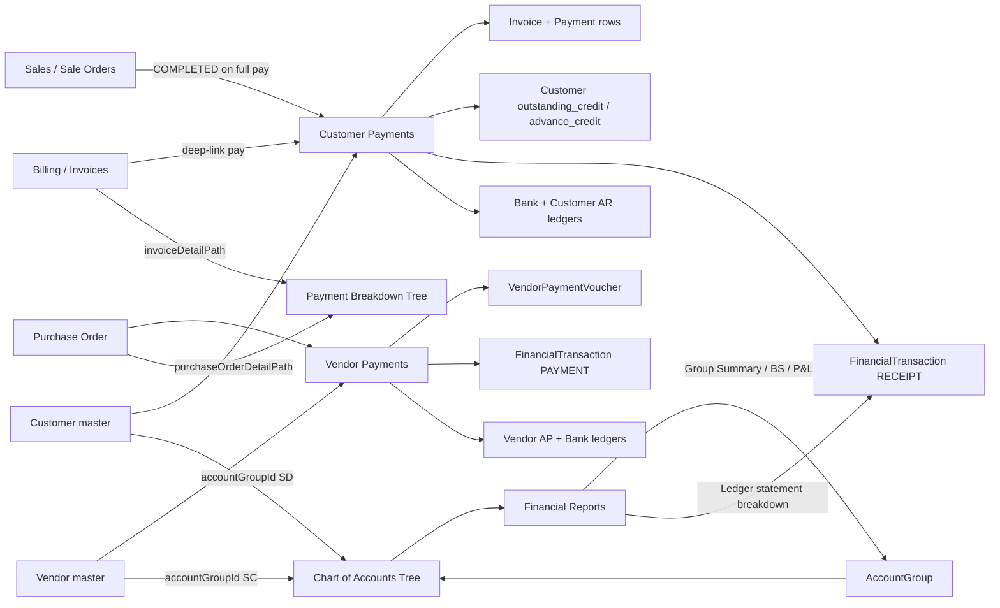

# Accounting Module — Ledgers, Payments, Expenses & Reports

This document covers the Financial Accounting domain: Chart of Accounts, customer/vendor payment vouchers, expenses, bank reconciliation, and P&L reporting.

## 1. Customer Payments (`/accounts/customer-payments`)

**Added 2026-07-05** — unified receipt voucher workflow replacing per-invoice Billing payments.

### Routes & API
| Layer | Path |
|-------|------|
| UI | `/accounts/customer-payments` |
| API | `GET/POST /api/customer-payments`, `GET /api/customer-payments/outstanding`, `GET/PATCH /api/customer-payments/:id`, `PATCH /api/customer-payments/:id/close` |
| Auth | `Accounts`, `Admin` roles |

### Data model
- **`CustomerPaymentVoucher`** — header: `receiptNumber` (`CRV-{year}-####`), `customerId`, `totalAmount`, `advanceAmount`, `paymentMethod`, `bankLedgerId`, audit fields, `closedStatus`/`closedAt`.
- **`CustomerPaymentVoucherItem`** — `{ voucherId, invoiceId, allocatedAmount }`.
- **`Payment.voucherId`** — links legacy per-invoice `Payment` rows to parent voucher.
- **`Customer.advance_credit`** — prepaid balance from advance/overpayment portions.

### Workflow
1. **Outstanding Invoices** tab — `ISSUED` / `PARTIALLY_PAID` invoices with balance > 0, grouped by customer (default), multi-select with select-all per group.
2. **Record Payment** — single form: payment amount, bank ledger, FIFO allocation by **due date** (manual override allowed).
3. **Overpayment** — user selects more invoices OR marks excess as **Advance payment** (`advanceAmount` → `customer.advance_credit`).
4. **Ledger** — one `FinancialTransaction` (`RECEIPT`) via `postCustomerPaymentReceipt()`: Dr Bank/Cash, Cr Customer AR (full `totalAmount`).
5. **Print** — `printCustomerPaymentReceipt()` HTML voucher (mirror vendor print pattern).

### Billing deep-link
Billing **Record Payment** / **Quick Close** navigates to:
`/accounts/customer-payments?customerId={id}&invoiceId={id}&openForm=1`

`POST /api/invoices/:id/payments` returns **HTTP 410** (`DEPRECATED_USE_CUSTOMER_PAYMENTS`).

---

## 2. Vendor Payments (`/accounts/vendor-payments`)

**Enhanced 2026-07-05** — outstanding PO queue + FIFO allocation.

### Routes & API
| Layer | Path |
|-------|------|
| UI | `/accounts/vendor-payments` |
| API | `GET/POST /api/vendor-payments`, `GET /api/vendor-payments/outstanding`, `GET/PATCH /api/vendor-payments/:id`, `PATCH /api/vendor-payments/:id/close` |

### Data model
- **`VendorPaymentVoucher`** / **`VendorPaymentVoucherItem`** — existing; one `PAYMENT` txn via `postVendorPayment()`.

### Workflow (2026-07-05 enhancements)
1. **Outstanding Payables** tab — POs in `PO_PARTIAL_RECEIVED`, `RECEIVED`, `INVOICE_RECEIVED` with outstanding > 0, grouped by vendor.
2. **Payment amount** is primary input; FIFO allocation by `expectedDeliveryDate` ?? `orderDate`.
3. Partially paid POs remain in queue until fully paid (`totalValue − sum(voucher items)`).

---

## 3. Shared Payment Allocation

**`src/backend/utils/paymentAllocation.js`** — `distributePayment({ items, totalAmount, overrides })`:
- Sort due date asc → order date asc → document number.
- Sequential fill; 2-decimal rounding; used by both customer and vendor create paths (server authoritative).

---

## 4. Chart of Accounts & Ledger Posting

### Three-level COA model (2026-07-05)

```
Primary Group  →  Account Group  →  Posting Ledger
Assets              Cash-in-Hand        Petty Cash (AC-1001)
                    Bank Accounts       HDFC (AC-1002), user banks
                    Sundry Debtors      AC-1003 (control) + AC-1003-C* (customer AR)
Liabilities         Sundry Creditors    AC-2001 (control) + AC-2001-V* (vendor AP)
Expenses            Direct / Indirect   COGS, Rent, etc.
```

| Event | Function | Txn type | Entries |
|-------|----------|----------|---------|
| Invoice issued | `postInvoice()` | SALE | Dr AR sub-ledger, Cr Sales, Cr GST |
| Invoice cancelled | `reverseInvoice()` | JOURNAL | Dr Sales, Dr GST, Cr AR |
| Customer payment | `postCustomerPaymentReceipt()` | RECEIPT | Dr Bank, Cr AR sub-ledger |
| Vendor payment | `postVendorPayment()` | PAYMENT | Dr AP sub-ledger, Cr Bank |
| Expense | `postExpense()` | JOURNAL | Dr category, Cr Bank |

**Control ledgers** `AC-1003` / `AC-2001` have `isGroupLedger: true`, `allowsDirectPosting: false`. `postTransaction()` throws `NON_POSTING_LEDGER` if any entry targets them.

Customer-owned AR and vendor-owned AP sub-ledgers are created with `accountGroupId` = Sundry Debtors / Sundry Creditors; resolved at posting via `getOwnedLedger()`.

**Cash/bank picker:** `GET /api/ledgers/cash-bank` → `ledgerService.getCashBankLedgers()` filters `GRP-CASH` / `GRP-BANK` groups only.

---

## 5. Account Groups & Financial Reports (2026-07-05)

### Routes & API
| Layer | Path |
|-------|------|
| COA tree UI | `/accounts/chart-of-accounts` (Tree / Table toggle) |
| Account groups API | `GET /api/account-groups`, `GET /api/account-groups/:id`, `GET /api/account-groups/:id/summary` |
| Group Summary | `GET /api/financial-reports/group-summary?groupId={id}` |
| Balance Sheet | `GET /api/financial-reports/balance-sheet` |
| Auth | `Accounts`, `Admin` roles |

### Data model
- **`AccountGroup`** — hierarchical groups with `nature`, `reportSection`, `pnlClassification`, `sortOrder`.
- **`Ledger.accountGroupId`** — classifies each posting ledger.
- **Seed:** `prisma/seed/account-groups-seed.js` — 19 system groups; maps AC-* ledgers; marks AC-1003/AC-2001 as control ledgers.

### UI
- **`ChartOfAccountsTree`** — expandable group → ledger hierarchy with nature/P&L badges; Summary / Statement actions.
- **Create ledger** — select Account Group first (filters nature); new bank ledgers under Bank Accounts group.
- **`FinancialReports.jsx`** — Group Summary tab + Balance Sheet tab; P&L uses group `pnlClassification` with `ExpenseCategory` fallback.

---

## 6. Payment Traceability Tree (2026-07-05)

Expandable breakdown on payment/receipt views showing invoice or PO allocations with navigation.

### Components
| Component | Usage |
|-----------|-------|
| `PaymentBreakdownTree` | Shared tree: receipt/payment root → invoice/PO lines + advance credit |
| `PaymentHistoryExpandRow` | Inline expand on payment history table rows |
| Detail dialogs | `CustomerPaymentDetailDialog`, `VendorPaymentDetailDialog` |

### Navigation paths (`src/constants/accountingPaths.js`)
| Target | Path |
|--------|------|
| Invoice detail | `/billing?invoiceId={id}&openDetail=1` |
| PO view | `/masters/purchase-orders/view/{id}` |

### Ledger statement breakdown
`financialReportService.getLedgerStatement()` enriches RECEIPT/PAYMENT rows with `breakdown`:
- Customer voucher → `items[]` with `invoice`, `advanceAmount`
- Vendor voucher → `items[]` with `purchaseOrder`
- Legacy single-invoice RECEIPT → single-line breakdown

List APIs include nested `items` for history inline expand without extra `getById` calls.

---

## 7. Linkages & Dependencies



| Module | Dependency |
|--------|------------|
| **Sales / Billing** | Invoice issue timing (`postInvoice` at ISSUED); payment routed to Customer Payments; invoice detail deep-link from payment breakdown; SO → `COMPLETED` on full invoice pay |
| **CRM** | `Customer.outstanding_credit`, `Customer.advance_credit`, customer AR sub-ledger with Sundry Debtors `accountGroupId` |
| **Procurement** | PO status gates vendor payables; vendor AP sub-ledger with Sundry Creditors `accountGroupId`; PO navigation from vendor payment breakdown |
| **Admin / Roles** | `customer_payments`, `vendor_payments`, chart-of-accounts / financial-reports permissions |

---

## 8. Source Files (primary)

| Area | Path |
|------|------|
| Customer payments UI | `src/pages/Accounting/CustomerPayments/` |
| Vendor payments UI | `src/pages/Accounting/VendorPayments/` |
| Payment breakdown tree | `src/components/accounting/PaymentBreakdownTree.jsx`, `PaymentHistoryExpandRow.jsx` |
| COA tree UI | `src/pages/Accounting/ChartOfAccounts/` |
| Account group service | `src/backend/services/accountGroupService.js` |
| Financial reports | `src/backend/services/financialReportService.js` |
| Customer payment service | `src/backend/services/customerPaymentService.js` |
| Vendor payment service | `src/backend/services/vendorPaymentService.js` |
| Accounting postings | `src/backend/services/accountingService.js` |
| Allocation utility | `src/backend/utils/paymentAllocation.js` |
| Path helpers | `src/constants/accountingPaths.js` |
| Account groups seed | `prisma/seed/account-groups-seed.js` |
| Role seed | `scripts/role-seed.js` (`customer_payments` in Accounts permissions) |
