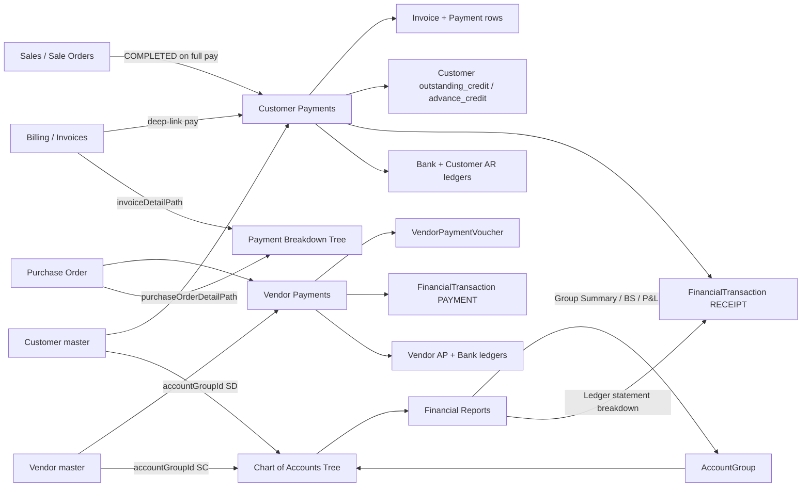

# Accounting Module — Ledgers, Payments, Expenses, Income & Reports

This document covers the Financial Accounting domain: Chart of Accounts, customer/vendor payment vouchers, expenses, income, bank accounts, bank reconciliation, and P&L reporting.

## 1. Customer Payments (`/accounts/customer-payments`)

**Added 2026-07-05** — unified receipt voucher workflow replacing per-invoice Billing payments.  
**Enhanced 2026-07-25** — cancel → reverse payment; Customer Credit Note document-only (no AR).

### Routes & API
| Layer | Path |
|-------|------|
| UI | `/accounts/customer-payments` |
| API | `GET/POST /api/customer-payments`, `GET /api/customer-payments/outstanding`, `GET/PATCH /api/customer-payments/:id`, `PATCH /api/customer-payments/:id/close`, `PATCH /api/customer-payments/:id/cancel` |
| Auth | `Accounts`, `Admin` roles |

### Data model
- **`CustomerPaymentVoucher`** — header: `receiptNumber` (`CRV-{year}-####`), `customerId`, `totalAmount`, `advanceAmount`, `paymentMethod`, `bankLedgerId`, audit fields, `closedStatus`/`closedAt`, **`cancelledStatus`/`cancelledAt`** (2026-07-25).
- **`CustomerPaymentVoucherItem`** — `{ voucherId, invoiceId, allocatedAmount }`.
- **`Payment.voucherId`** — links legacy per-invoice `Payment` rows to parent voucher.
- **`Customer.advance_credit`** — prepaid balance from advance/overpayment portions.

### Workflow
1. **Outstanding Invoices** tab — `ISSUED` / `PARTIALLY_PAID` invoices with balance > 0, grouped by customer (default), multi-select with select-all per group. **Record Payment** and **New Payment** both use this Outstanding List UI for invoice selection (2026-07-14); create dialog opens after selection / deep-link preselect.
2. **Record Payment** — single form: payment amount, bank ledger, FIFO allocation by **due date** (manual override allowed).
3. **Overpayment** — user selects more invoices OR marks excess as **Advance payment** (`advanceAmount` → `customer.advance_credit`).
4. **Ledger** — one `FinancialTransaction` (`RECEIPT`) via `postCustomerPaymentReceipt()`: Dr Bank/Cash, Cr Customer AR (full `totalAmount`).
5. **Print** — `printCustomerPaymentReceipt()` HTML voucher (mirror vendor print pattern).
6. **Payment History (2026-07-14):** Multi-column register — receipt/ref, date, customer, amount, status (Open/Closed/Cancelled), method, reference, advance when &gt; 0.
7. **Cancel → Reverse (2026-07-25):** `PATCH …/cancel` posts reversing RECEIPT via `postReversingTransaction`, restores invoice `paidAmount`/status and customer `outstanding_credit`/`advance_credit`. Blocked when original FT `isReconciled`. Badge **Cancelled / Reversed**.
8. **Credit Notes (2026-07-25):** New Customer **Credit Notes** are **document-only** (no `outstanding_credit` change, no `postCreditNote`). Customer **Debit Notes** still post to AR. Historical CNs that posted AR are left as-is; cancel of those still reverses AR when an FT exists.

### Billing deep-link
Billing **Record Payment** / **Quick Close** navigates to:
`/accounts/customer-payments?customerId={id}&invoiceId={id}&openForm=1`

`POST /api/invoices/:id/payments` returns **HTTP 410** (`DEPRECATED_USE_CUSTOMER_PAYMENTS`).

---

## 2. Vendor Payments & Vendor Invoices (`/accounts/vendor-payments`)

**Enhanced 2026-07-05** — outstanding queue + FIFO.  
**Invoice-first (prior bundle) + 2026-07-25:** pay against Vendor Invoices only; cancel → reverse; eligible-PO picker; Vendor DN document-only.

### Routes & API
| Layer | Path |
|-------|------|
| UI | `/accounts/vendor-payments` |
| API | `GET /api/vendor-payments`, `POST /api/vendor-payments/from-invoices` (supported create), `GET …/outstanding`, `GET/PATCH /:id`, `PATCH /:id/close`, `PATCH /:id/cancel` |
| Vendor Invoice | `GET/POST /api/accounting/vendor-invoices`, `GET …/eligible-pos?vendorId=`, cancel |
| Auth | `Accounts`, `Admin` |

### Data model
- **`VendorPaymentVoucher`** / **`VendorPaymentVoucherItem`** — invoice-first items use `vendorInvoiceId`; `cancelledStatus`/`cancelledAt` (2026-07-25). One `PAYMENT` txn via `postVendorPayment()`.
- **`VendorInvoice`** / **`VendorInvoiceItem`** — register supplier invoice against PO(s) before payment.

### Workflow
1. **Register Vendor Invoice** — select eligible POs (`GET …/eligible-pos`) excluding: POs already on a non-cancelled Vendor Invoice, status `INVOICE_RECEIVED`/`PAID`, or non-empty `supplierInvoiceNo` (eligible statuses = `PO_PARTIAL_RECEIVED` | `RECEIVED` only); enter supplier invoice no, amounts, upload copy.
2. **Outstanding Vendor Invoices** — multi-select same vendor; **Record Payment** = total amount → FIFO to invoices (mirrors customer payment). Legacy PO-direct create UI removed; `POST /api/vendor-payments/` returns `USE_INVOICE_PAYMENT`.
3. **Cancel → Reverse (2026-07-25):** reverse PAYMENT FT; restore VendorInvoice paid/status; block if reconciled.
4. **Vendor Debit Notes (2026-07-25):** document-only (no AP posting). Vendor **Credit Notes** still post to AP.

---

## 3. Shared Payment Allocation

**`src/backend/utils/paymentAllocation.js`** — `distributePayment({ items, totalAmount, overrides })`:
- Sort due date asc → order date asc → document number.
- Sequential fill; 2-decimal rounding; used by both customer and vendor create paths (server authoritative).

---

## 4. Chart of Accounts & Ledger Posting

### Three-level COA model (2026-07-05)

```
Primary Group  →  Account Group  →  Posting Ledger
Assets              Cash-in-Hand        Petty Cash (AC-1001)
                    Bank Accounts       HDFC (AC-1002), user banks
                    Sundry Debtors      AC-1003 (control) + AC-1003-C* (customer AR)
Liabilities         Sundry Creditors    AC-2001 (control) + AC-2001-V* (vendor AP)
Expenses            Direct / Indirect   COGS, Rent, etc.
```

| Event | Function | Txn type | Entries |
|-------|----------|----------|---------|
| Invoice issued | `postInvoice()` | SALE | Dr AR sub-ledger, Cr Sales, Cr GST |
| Invoice cancelled | `reverseInvoice()` | JOURNAL | Dr Sales, Dr GST, Cr AR |
| Customer payment | `postCustomerPaymentReceipt()` | RECEIPT | Dr Bank, Cr AR sub-ledger |
| Customer/vendor payment cancel | `postReversingTransaction()` | reverse | Opposite Dr/Cr of original |
| Vendor payment | `postVendorPayment()` | PAYMENT | Dr AP sub-ledger, Cr Bank |
| Expense | `postExpense()` | JOURNAL | Dr category, Cr Bank |
| Income (2026-07-25) | `postIncome()` | JOURNAL / INCOME | Dr Bank/Cash, Cr Income category ledger |
| Customer CN (new) | — | document only | No AR / no FT |
| Vendor DN (new) | — | document only | No AP / no FT |

**Control ledgers** `AC-1003` / `AC-2001` have `isGroupLedger: true`, `allowsDirectPosting: false`. `postTransaction()` throws `NON_POSTING_LEDGER` if any entry targets them.

Customer-owned AR and vendor-owned AP sub-ledgers are created with `accountGroupId` = Sundry Debtors / Sundry Creditors; resolved at posting via `getOwnedLedger()`.

**Cash/bank picker:** `GET /api/ledgers/cash-bank` → `ledgerService.getCashBankLedgers()` filters `GRP-CASH` / `GRP-BANK` groups only (includes `currentBalance`). **UI (2026-07-26):** payment account selects show `{ledgerName} — ₹{balance}` via `formatCashBankLedgerLabel` (`src/utils/cashBankLedgerLabel.js`) on Vendor Payment (from invoices), Customer Payment, Expense, Billing Record Payment, and **Income From/To** (`cash-bank-capital`, optional group suffix e.g. `Cash in Hand (Cash) — ₹1,234.00`).

---

## 5. Account Groups & Financial Reports (2026-07-05)

### Routes & API
| Layer | Path |
|-------|------|
| COA tree UI | `/accounts/chart-of-accounts` (Tree / Table toggle) |
| Account groups API | `GET /api/account-groups`, `GET /api/account-groups/:id`, `GET /api/account-groups/:id/summary` |
| Group Summary | `GET /api/financial-reports/group-summary?groupId={id}` |
| Balance Sheet | `GET /api/financial-reports/balance-sheet` |
| Auth | `Accounts`, `Admin` roles |

### Data model
- **`AccountGroup`** — hierarchical groups with `nature`, `reportSection`, `pnlClassification`, `sortOrder`.
- **`Ledger.accountGroupId`** — classifies each posting ledger.
- **Seed:** `prisma/seed/account-groups-seed.js` — 19 system groups; maps AC-* ledgers; marks AC-1003/AC-2001 as control ledgers.

### UI
- **`ChartOfAccountsTree`** — expandable group → ledger hierarchy with nature/P&L badges; Summary / Statement actions.
- **Create ledger** — select Account Group first (filters nature); new bank ledgers under Bank Accounts group.
- **`FinancialReports.jsx`** — Group Summary tab + Balance Sheet tab; P&L uses group `pnlClassification` with `ExpenseCategory` fallback.

---

## 6. Payment Traceability Tree (2026-07-05)

Expandable breakdown on payment/receipt views showing invoice or PO allocations with navigation.

### Components
| Component | Usage |
|-----------|-------|
| `PaymentBreakdownTree` | Shared tree: receipt/payment root → invoice/PO lines + advance credit |
| `PaymentHistoryExpandRow` | Inline expand on payment history table rows |
| Detail dialogs | `CustomerPaymentDetailDialog`, `VendorPaymentDetailDialog` |

### Navigation paths (`src/constants/accountingPaths.js`)
| Target | Path |
|--------|------|
| Invoice detail | `/billing?invoiceId={id}&openDetail=1` |
| PO view | `/masters/purchase-orders/view/{id}` |

### Ledger statement breakdown
`financialReportService.getLedgerStatement()` enriches RECEIPT/PAYMENT rows with `breakdown`:
- Customer voucher → `items[]` with `invoice`, `advanceAmount`
- Vendor voucher → `items[]` with `purchaseOrder`
- Legacy single-invoice RECEIPT → single-line breakdown

List APIs include nested `items` for history inline expand without extra `getById` calls.

---

## 7. Linkages & Dependencies


```mermaid
graph LR
    Billing[Billing / Invoices] -->|deep-link pay| CP[Customer Payments]
    Billing -->|invoiceDetailPath| PB[Payment Breakdown Tree]
    CP --> Invoice[Invoice + Payment rows]
    CP --> Customer[Customer outstanding_credit / advance_credit]
    CP --> FT[FinancialTransaction RECEIPT]
    CP --> Ledger[Bank + Customer AR ledgers]

    PO[Purchase Order] --> VP[Vendor Payments]
    PO -->|purchaseOrderDetailPath| PB
    VP --> VPV[VendorPaymentVoucher]
    VP --> FT2[FinancialTransaction PAYMENT]
    VP --> Ledger2[Vendor AP + Bank ledgers]

    Sales[Sales / Sale Orders] -->|COMPLETED on full pay| CP
    CRM[Customer master] --> CP
    CRM -->|accountGroupId SD| COA
    Procurement[Vendor master] --> VP
    Procurement -->|accountGroupId SC| COA
    AG[AccountGroup] --> COA[Chart of Accounts Tree]
    COA --> Reports[Financial Reports]
    Reports -->|Group Summary / BS / P&L| AG
    Reports -->|Ledger statement breakdown| FT
```

| Module | Dependency |
|--------|------------|
| **Sales / Billing** | Invoice issue timing (`postInvoice` at ISSUED); payment routed to Customer Payments; invoice detail deep-link from payment breakdown; SO → `COMPLETED` on full invoice pay |
| **CRM** | `Customer.outstanding_credit`, `Customer.advance_credit`, `Customer.credit_days`, customer AR sub-ledger with Sundry Debtors `accountGroupId` |
| **Procurement** | PO status gates vendor payables; vendor AP sub-ledger with Sundry Creditors `accountGroupId`; PO navigation from vendor payment breakdown |
| **Admin / Roles** | `customer_payments`, `vendor_payments`, chart-of-accounts / financial-reports permissions |

---

## 8. Source Files (primary)

| Area | Path |
|------|------|
| Customer payments UI | `src/pages/Accounting/CustomerPayments/` |
| Vendor payments UI | `src/pages/Accounting/VendorPayments/` |
| Payment breakdown tree | `src/components/accounting/PaymentBreakdownTree.jsx`, `PaymentHistoryExpandRow.jsx` |
| COA tree UI | `src/pages/Accounting/ChartOfAccounts/` |
| Account group service | `src/backend/services/accountGroupService.js` |
| Financial reports | `src/backend/services/financialReportService.js` |
| Customer payment service | `src/backend/services/customerPaymentService.js` |
| Vendor payment service | `src/backend/services/vendorPaymentService.js` |
| Accounting postings | `src/backend/services/accountingService.js` |
| Allocation utility | `src/backend/utils/paymentAllocation.js` |
| Path helpers | `src/constants/accountingPaths.js` |
| Expenses UI | `src/pages/Accounting/Expenses/` — category from Expense Category (type auto), optional `Expense.dueDate`, Payment Account via `getCashBankLedgers()` array unwrap |
| Income UI (2026-07-25) | `src/pages/Accounting/Income/`, `src/pages/IncomeCategory/` — Bank Transfer / Loan categories; Dr Bank Cr Income |
| Bank Accounts UI (2026-07-25) | `src/pages/Accounting/BankAccounts/` — manage GRP-CASH / GRP-BANK posting ledgers (no shadow master) |
| Income / bank APIs | `incomeService.js`, `bankAccountService.js`; routes `/api/incomes`, `/api/income-categories`, `/api/bank-accounts` |
| Account groups seed | `prisma/seed/account-groups-seed.js` |
| Role seed | `scripts/role-seed.js` — Accounts includes `customer_payments`, `vendor_payments`, `income`, `bank_accounts`, `income_categories` (KB-026: keep `role.constants.js` + seed in sync) |

---

## 9. Income & Bank Accounts (2026-07-25)

### Income
- Models: `IncomeCategory`, `Income` (mirror Expense pattern); seed categories **Bank Transfer**, **Loan** with Indirect Income ledgers (e.g. AC-3003 / AC-3004).
- **From / To ledgers (2026-07-25):** Create requires `fromLedgerId` + `toLedgerId` among GRP-CASH / GRP-BANK / GRP-CAPITAL (picker `GET /api/ledgers/cash-bank-capital`). Posting **Dr To, Cr From** via `postIncome` (capital→bank, profit share to owner/partner). Soft-delete reverses via `postReversingTransaction`.
- **UI (2026-07-26):** Record Income reloads categories + transfer ledgers on dialog open (independent loads + toast on failure). Category parse mirrors Expenses (`success` / array / `data`). From/To options show balance via `formatCashBankLedgerLabel` (group suffix kept).
- Permissions: `income`, `income_categories` (must exist in `PERMISSION_CATALOG` + role-seed).

### Bank Account manage
- UI/API list/create/update cash/bank ledgers under `GRP-CASH` / `GRP-BANK` via `ledgerService` + `bankAccountService`.
- Permission: `bank_accounts`. Capital ledgers (Owner’s Capital / partners) are selectable on Income From/To via cash-bank-capital picker (COA Capital group).

### Notes UI (2026-07-25 follow-up)
- Customer Payments: **Credit Notes** tab only (Debit Note create rejected `CUSTOMER_DEBIT_NOTE_DISABLED`).
- Vendor Payments: **Debit Notes** tab only (Credit Note create rejected `VENDOR_CREDIT_NOTE_DISABLED`).
- New Customer CN / Vendor DN remain document-only (no party AR/AP).
