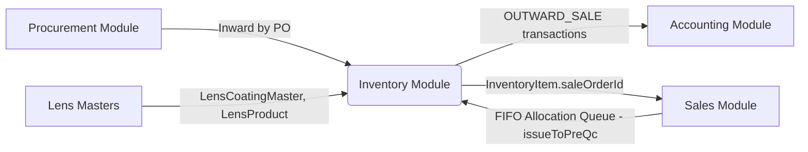

# Module Specification — Inventory

This document details the functional specifications, technical implementation, and cross-module linkages for the **Inventory** module.

---

## 1. Functional Overview

The Inventory module manages:

* **Initial Inward (Manual):** A 3-step wizard (`InventoryInitializationForm.jsx`) lets a user pick a Location → select Type/Category/Lens Product/Coating → enter Sph/Cyl/Add ranges (0.25-step cartesian product via `BulkLensSelection.jsx`) → allocate to trays with per-spec Qty (auto-fills to available gap) and per-spec Price (auto-fills from global cost price). Coating is required before the grid can be displayed. The generated spec list is shown as an expandable card grouped by Coating.
* **Inward by PO:** Purchase-order-driven receipt queue (`POInwardToInventory.jsx`). Confirmed working end-to-end. Live tray capacity badge reflects in-form sibling-row allocations via `siblingAllocatedQty()` — shows **"Tray Full — X/X"** immediately when another row fills the same tray, without waiting for submit. **Inward Queue (Pass K)** lists only stock-type PO receipts (direct POs and POs from `STOCK`-type SOs); RX-type PO receipts are hidden and consumed via Issue Stock auto-inward instead.
* **Tray-to-tray transfer (Pass K):** `InventoryTransactionForm` allows same-location transfers when trays differ. Backend `TRANSFER` supports full relocate and partial-qty split (new `InventoryItem` at destination) with atomic source/destination `InventoryStock` updates.
* **Tray Master / Location Master:** Organizes stock into designated physical bins (trays) inside locations.
* **SO Request Query (tab inside Inventory module):** `InventoryRequestQueueTab.jsx` — lists Sale Orders requiring stock allocation (driven by `INVENTORY_QUEUE_STATUSES`). "Issue & Pre-QC" button opens `StockPickModal.jsx` before transitioning the SO to `PRE_QC`. Includes live filter controls (by Customer, Product, Customer Ref No, and SO Number) and collapsible grouping options (by Customer or Product). No standalone route; reachable only as a tab within the Inventory module.
  * **FIFO soft allocation (Pass M):** Queue load soft-claims matching AVAILABLE units across waiting SOs oldest-first (in-memory; no `reservedStock` write). Banner shows aggregate `softReservedQty`. Per-card In/Out of Stock uses soft-aware `isStockAvailable` + `shortageRight` / `shortageLeft`.
  * **Stock Pick Modal (Pass D):** Shows the SO's product name + coating + per-eye Sph/Cyl/Add specs at the top. Lists FIFO matches from **both** physical `InventoryItem` rows (`inv_<id>`) and pending `PurchaseOrderReceipt` rows from the Inward Queue (`rec_<id>`, badged "Inward Queue", purple-themed row). Selecting a `rec_` row and confirming auto-inwards that receipt's pending qty (1 unit) into a new `InventoryItem` + `InventoryTransaction` + `InventoryStock` bucket update, then reserves it for the SO — all inside one `prisma.$transaction`. Pass M: matches exclude units soft-claimed by earlier waiting SOs.
  * **Raise PO (Pass M):** Defaults to shortage eyes/qty only; `RaisePoModal` lets the user edit Left / Right / Both (constrained to SO eyes) before confirm.
* **Transactions Log:** Record of all stock updates for value auditing. Supports filtering by transaction `type` (Pass D) via a dropdown, and can be deep-linked from the Dashboard's Inward/Outward value click-through (`location.state.filterType`).
* **Stock Summary:** Toggle between the original Pivot Grid view and an Expandable List view (grouped by Location / Location+Tray / Category / Lens Product / none), each with its own AND-combined filters; Pivot retains Excel/PDF exports (Pass C/D — complete). Since Pass J, both views (and the Initialize Stock Grid's tray-occupancy/capacity check) exclude **RX-sourced stock** — `InventoryItem` rows whose originating `PurchaseOrder.saleOrderId` is set (i.e. procured specifically for one customer's Sale Order) — so these surfaces only reflect general/stock-type inventory, not RX-earmarked stock. This does not affect FIFO picking, low-stock alerts, or the `InventoryStock` bucket table itself, which still account for all stock regardless of source. **List product cell (2026-07-14):** after product name, show compact SPH/CYL/ADD (and related optical fields when present) via `formatItemPowerRange` in `useInventoryColumns` — display-only.
* **Dashboard:** Analytics cards — **Available** shows summed `InventoryStock.availableStock` (Pass E). **Reserved** primary value is queue **`softReservedQty`** (same FIFO soft allocation as SO Request Query; Pass M follow-on); hard `InventoryStock.reservedStock` (`reservedItems`) is shown as subtitle when &gt; 0. Soft claims are merged in `inventoryController.getInventoryDashboard` via parallel `computeQueueSoftAllocation()` — not written into `reservedStock`. "Inward / Outward Quantity Trend" chart plots daily summed transaction *quantity*, not ₹ value. Top 10 / Low 10 selling products side-by-side, Excel/PDF export.

> **Nav:** Inventory module tab bar = `Dashboard | Inward Queue | SO Request Query | Transactions | Stock Summary`. The "Items" tab and "Add Item" button have been removed — no manual inventory creation allowed except via Initial Inward or PO Inward.

---

## 2. Technical Design

### Key Frontend Files

| File | Role |
|------|------|
| `InventoryMain.jsx` | Top-level tab router (5 tabs) |
| `InventoryInitializationForm.jsx` | 3-step manual inward wizard |
| `BulkLensSelection.jsx` | Coating + range inputs + Sph×CYL/ADD grid + expandable spec list |
| `POInwardToInventory.jsx` | PO-receipt-driven inward with live tray badge (`siblingAllocatedQty`) |
| `InventoryRequestQueueTab.jsx` | SO queue tab with FIFO stock pick trigger |
| `StockPickModal.jsx` | FIFO allocation dialog reused for Request Queue |
| `InventoryDashboard.jsx` | Stat cards + charts + Excel/PDF export |
| `InventoryStockTab.jsx` | Stock summary pivot + AND-combined filters + Excel/PDF export |
| `InventoryInwardQueueTab.jsx` | PO inward queue listing |
| `InventoryTransactionsTab.jsx` | Transaction log tab |

### Key Backend Files

| File | Role |
|------|------|
| `inventory.service.js` | Core service: `bulkInwardFromGrid`, `reserveInventoryForSale` (qty-aware + `dbClient` threading), `updateInventoryStock`, `generateTransactionNumber`, `getInventorySpecCountTrend`, `getTopLowSellingProducts`, `getInventoryStockPivot`, `getInventoryStockGrouped` (list view), `getStockValueReport` (daily `trend` array — `inward`/`outward` are now summed transaction *quantity*, not ₹ value, since Pass E; the `summary`/`data` ₹ breakdown is unchanged), `getInventoryDashboardEnhanced` (`availableItems`/`reservedItems` sourced from `InventoryStock.availableStock`/`reservedStock`, not `InventoryItem` row count/quantity, since Pass E). Since Pass J: module-level `RX_SOURCE_EXCLUSION_FILTER` const applied in `getInventoryStockPivot`, `getInventoryStockWithGrouping` (ungrouped + all 4 grouped branches), and `getTrayOccupancy`; the grouped branches of `getInventoryStockWithGrouping` no longer read the `InventoryStock` bucket table (which has no PO/RX linkage) — they now live-aggregate off `InventoryItem` via `prisma.groupBy` keyed on the bucket's natural unique key (`lens_id, category_id, Type_id, coating_id, location_id, tray_id`), with a second `groupBy` (same keys + `status`) to split out `reservedStock`/`damagedStock`. Pass K: `getInventoryInwardQueue` filters to stock-type POs only; `createInventoryTransaction` TRANSFER supports partial-qty split + same-tx stock bucket updates. |
| `saleOrderWorkflowService.js` | `issueToPreQc()` — wraps `reserveInventoryForSale` in a `prisma.$transaction`; threads `tx` as `dbClient` so all eye reservations roll back together on failure. Pass D: also handles `rec_<id>` selections by auto-inwarding the receipt (creates `InventoryItem`+`InventoryTransaction`+stock bucket) before reserving. Pass M: `getInventoryQueue` uses `computeQueueSoftAllocation()` for FIFO soft claims + `softReservedQty`; `raisePoFromSo()` defaults to shortage eyes via `resolvePoEyes` with optional eye overrides. |
| `softAllocationHelper.js` | Pass M: shared in-memory FIFO soft-claim helpers (`softAllocateOrderEyes`, `resolvePoEyes`, pool claim utilities) used by queue load and Issue match filtering. |
| `saleOrderService.js` | `getMatchingInventoryFIFO()` — Pass D: also queries matching `PurchaseOrderReceipt`s (filtered to `totalReceivedQty > inwardedQty`) alongside physical stock, returns both `inv_`/`rec_`-prefixed plus the parent `saleOrder` (with product/coating/type) for the modal header. Pass K: `buildWhereClause` / `buildPoWhereClause` treat `STOCK`-type linked SOs as general stock (pickable by any order), alongside null-SO stock and current-SO RX reservations. Pass L: SPH/CYL/ADD use `normalizeOpticalSpecValue` / `addSpecMatch` so null/empty ≡ `0` and effective zero also matches SQL `NULL` (Axis/Dia untouched). Pass M: default `applySoftClaims: true` filters matches already soft-claimed by earlier waiting SOs. |
| `purchaseOrderService.js` | `getPurchaseOrderById` selects `saleOrder.procurementType` so receive UI can classify stock vs RX POs. |
| `inventory.routes.js` / `inventoryController.js` | REST API layer |

### Key Data Rules

* **`reserveInventoryForSale(inventoryItemId, quantity, saleOrderId, userId, dbClient = prisma)`:**
  - Quantity-aware status flip: if `remainingQty ≤ 0.001` → status = `RESERVED`, `saleOrderId` + `reservedDate` set. Otherwise stays `AVAILABLE` with decremented `quantity`.
  - Accepts optional `dbClient` (defaults to `prisma`). When called from `issueToPreQc`'s `prisma.$transaction`, the transaction's `tx` is passed through so all reservations in one call are atomic.
* **`bulkInwardFromGrid`:** Accepts `coating_id` at top level and optional `costPrice` per `splits[]` entry (falls back to form-level `costPrice` via `??`, not `||` — preserves explicit `0`).
* **Tray Live Badge (PO Inward):** `effectiveAvailable = trayOccupancy.availableQty - siblingAllocatedQty(trayId, excludeRowKey, excludeSplitIdx)`. Badge turns red with "Tray Full — X/X" when `effectiveAvailable ≤ 0`.
* **Date-range `endDate` filters on `transactionDate` must use end-of-day, not a bare `new Date(endDate)`:** A date-only string parses to UTC-midnight-start-of-day, which on an IST server silently excludes most of the final day(s) of a range. `getStockValueReport()` and `getInventoryTransactions()` both normalize via `end.setHours(23,59,59,999)` before using it as `lte` (Pass F; same pattern already used by `getInventorySpecCountTrend()`). Apply this pattern to any future `startDate`/`endDate` range filter on a `DateTime` column.
* **`InventoryItem.quantity` is NOT a reliable source for RESERVED-row totals:** `reserveInventoryForSale()` zeroes a row's own `quantity` in the same write that flips its `status` to `RESERVED` (the field represents "how much of this row is still unreserved," always ~0 once fully reserved). Any future Available/Reserved/stock-quantity aggregate must use `InventoryStock.availableStock`/`reservedStock`/`totalStock`/`damagedStock` (bucket-level running totals maintained by `updateInventoryStock()`), not `InventoryItem.quantity` summed across rows.
* **RX-sourced stock exclusion (Pass J / Refined):** An `InventoryItem` is RX-sourced iff its `purchaseOrder.saleOrderId` is non-null AND the linked `saleOrder.procurementType === 'RX'`. The correct Prisma filter is `NOT: { purchaseOrder: { saleOrder: { procurementType: 'RX' } } }` (module-level `RX_SOURCE_EXCLUSION_FILTER` in `inventory.service.js`) — **not** the simpler `{ purchaseOrder: { saleOrder: { procurementType: 'RX' } } }` form, since on an optional relation that form would drop every row with `purchaseOrderId = null` (i.e. manually-initialized stock). When adding RX-exclusion to any new query, reuse the `NOT` form.
* **Stock vs RX PO classification (Pass K):** Direct PO (`saleOrderId` null) and PO linked to `procurementType === 'STOCK'` → stock-type (Inward Queue + general FIFO). PO linked to `procurementType === 'RX'` → RX-type (hidden from Inward Queue; FIFO-reserved to that SO only). Do not treat "any non-null `saleOrderId`" as RX — STOCK-raised POs are general stock.
* **FIFO optical-spec null≡0 (Pass L):** For SPH / CYL / ADD only, `null` / `undefined` / `""` coerce to `"0"` before match. When the effective value is numeric 0, Prisma where accepts string zero variants **or** SQL `NULL` on that column. Do **not** omit the field when SO side is null (that falsely matches non-zero stock). Axis / Dia must not use this optical normalizer.
* **Queue FIFO soft allocation (Pass M):** Soft claims are display/Issue-filter only — do **not** write `InventoryStock.reservedStock` or flip `InventoryItem` to `RESERVED` until Issue & Pre-QC. Soft-reserved signal for waiting SOs is queue API `softReservedQty` and Dashboard Reserved primary; Stock Summary Reserved column remains hard-reserve only.
* **`InventoryStock` bucket cannot answer "non-RX only" queries:** it has no relation to `PurchaseOrder`/`saleOrderId` and permanently mixes RX + non-RX quantities once accumulated (its update lifecycle, `updateInventoryStock()`, is also relied on by FIFO picking and low-stock alerts, so it must keep reflecting *all* stock). Any future "RX-excluded" display surface reading grouped/aggregated stock must aggregate live off `InventoryItem` (see `getInventoryStockWithGrouping`'s grouped branches) rather than extending the bucket table.

---

## 3. Linkages & Dependencies

* **Procurement:** PO receipts feed `InventoryInwardQueueTab`; `POInwardToInventory.jsx` creates `InventoryItem` rows per spec+tray.
* **Lens Masters:** `getInventoryDropdowns()` returns `coatings` (from `LensCoatingMaster`), `lensProducts`, `lensTypes`, `categories` — used by both `BulkLensSelection` and `InventoryInitializationForm`.
* **Sales:** Sale Orders with `INVENTORY_QUEUE_STATUSES` appear in `InventoryRequestQueueTab` (displayed as the **SO Request Query** tab). Queue soft allocation + shortage Raise PO live in `saleOrderWorkflowService` / `softAllocationHelper`. `issueToPreQc()` calls `reserveInventoryForSale()` per selected `InventoryItem` (or auto-inwards + reserves for a `rec_` receipt selection), transitioning the SO to `PRE_QC`. `getMatchingInventoryFIFO(saleOrderId)` populates `StockPickModal` with FIFO-ordered matches from both physical stock and the Inward Queue, filtered by earlier soft claims (Pass M).
* **Procurement (extended, Pass D):** `PurchaseOrderReceipt.inwardedQty` now tracks partial consumption from the Sales side too (incremented by `issueToPreQc`'s auto-inward), not just from the dedicated PO Inward screen — any future Procurement-side reporting on receipt pending-qty must account for both sources.
* **Accounting:** `inventoryTransaction.create()` (type `OUTWARD_SALE`) is called inside `reserveInventoryForSale()`, feeding the cost-price valuation used in financial reporting. Pass D adds a second write path: `INWARD_PO`-type transactions created by the auto-inward branch of `issueToPreQc()`.

---

## 4. Pass History

| Pass | Scope | Status | Shipped |
|------|-------|--------|---------|
| **Pass A** | Product Inward flows (1a/1b/1c) + Items tab removal | ✅ QA PASSED | 2026-06-27 |
| **Pass B** | Dashboard analytics (relabel, graphs, Top10/Low10, export) | ✅ QA PASSED | 2026-06-27 |
| **Pass C** | Stock Summary pivot + filters + export | ✅ QA PASSED | 2026-06-27 |
| **Pass D** | Dashboard Top/Low side-by-side + value-trend fix + click-to-filter Transactions; Stock Summary Pivot/List toggle; SO Request Queue — Stock Pick Modal product/specs header + Inward Queue allocation + auto-inward-on-issue | ✅ QA PASSED (static review — no live DB/browser run; see `feature.md` Test results) | 2026-06-27 |
| **Pass E** | Inward/Outward Dashboard chart switched from ₹ value to quantity; Available/Reserved stat cards switched from `InventoryItem` row count/quantity to `InventoryStock.availableStock`/`reservedStock` sums (1 rework cycle — first attempt summing `InventoryItem.quantity` for RESERVED failed QA, see Key Data Rules above) | ✅ QA PASSED (static review — no live DB/browser run) | 2026-06-27 |
| **Pass F** | Fixed Inward/Outward Quantity Trend chart silently dropping the most recent day(s) of a range (`getStockValueReport()`'s `endDate` `lte` filter parsed as UTC-midnight-start-of-day instead of end-of-day; same bug also fixed in `getInventoryTransactions()`'s Transactions Log date filter). See `KB-022`. | ✅ QA PASSED (static review + Node-simulated boundary check — no live DB/browser run) | 2026-06-27 |
| **Pass G** | Follow-on to Pass F, found via live use: backend fix alone wasn't enough — `InventoryDashboard.jsx`'s `dateRangeToParams()` computed "today" via `toISOString()` (UTC), which under-reports the local IST date by one day during the midnight–5:30 AM window, so "today" never reached the backend at all. Added `toLocalDateStr()` helper using local `getFullYear/getMonth/getDate`; applied to both `startDate` and `endDate` in the `7d`/`30d` branches. See `KB-022` (extended). | ✅ QA PASSED (static review + Node-simulated `dateRangeToParams()` output + production `vite build` — no live DB/browser run) | 2026-06-27 |
| **Pass H** | Initial Stock Grid Inward Workflow: Simplified manual stock grid inward wizard into a 2-step setup. Enabled direct Product selection from a single dropdown, full Cartesian range combinations generation, expandable coating card view, and in-line tray and price allocations with live capacity validation. Fixed pre-existing backend bug where invalid `rightDia`/`leftDia` parameters crashed manual stock grid inward operations in database. | ✅ QA PASSED (L1 build + Node-simulated service integration test with DB transaction rollback) | 2026-06-27 |
| **Pass I** | Initial Stock Inward Location Optimization: Moved Location selection from Step 1 (global parameter) to Step 2 (per-spec row parameter), enabling multi-location stock initialization in a single batch. Updated backend API `bulkInwardFromGrid` to support split-level Location ID and validated correctly. | ✅ QA PASSED (L1 build + Node-simulated service integration test with DB transaction rollback) | 2026-06-27 |
| **Pass J** | Exclude RX-sourced stock (`InventoryItem`s from a `PurchaseOrder` with a non-null `saleOrderId`) from the Stock Summary List (pivot + all 4 grouped list modes) and the Initialize Stock Grid's tray-occupancy/capacity check. Grouped list branches were switched from reading the `InventoryStock` bucket table to a live `InventoryItem.groupBy` aggregation (bucket table has no RX/PO linkage). 1 rework cycle — first attempt was missing `availableStock`/`reservedStock`/`damagedStock`/`lastCostPrice`/`lastInwardDate` on the new aggregated rows, caught by QA via live-seeded-data verification. | ✅ QA PASSED (L1 build + live-seeded-data verification: RX item excluded from pivot/list/tray-occupancy, non-RX totals and stock-breakdown fields numerically confirmed correct, test data cleaned up afterward) | 2026-07-01 |
| **Pass K** | Inventory Workflow Corrections: Inward Queue filters to stock-type POs only; PO receive `isStockPO` uses `procurementType`; tray-to-tray TRANSFER allows same location + partial qty split; FIFO matching treats STOCK-linked PO items as general stock. | ✅ QA PASSED (static + build) | 2026-07-14 |
| **Pass L** | SO Request Queue false Out of Stock: FIFO SPH/CYL/ADD match treats null/empty as 0 and accepts SQL NULL when effective value is 0 (fixes SO `"0"` vs Inv `null` asymmetry). Pass K STOCK/RX scope unchanged. | ✅ QA PASSED (`stockCheckAPI` 6/6) | 2026-07-14 |
| **Pass M** | SO Request Queue FIFO soft allocation + shortage Raise PO: in-memory oldest-first soft claims; `softReservedQty` banner; Issue no-double-claim via `applySoftClaims`; Raise PO defaults to shortage eyes with L/R/Both edit. No schema / no soft write to `reservedStock`. | ✅ QA PASSED (`stockCheckAPI`+`issueStock` 15/15, L1–L5) | 2026-07-14 |
| **Pass M+** | Inventory Dashboard Reserved card primary = `softReservedQty` (controller merges `computeQueueSoftAllocation`); hard `reservedItems` as subtitle. | ✅ QA PASSED (16/16, L1–L5) | 2026-07-14 |
