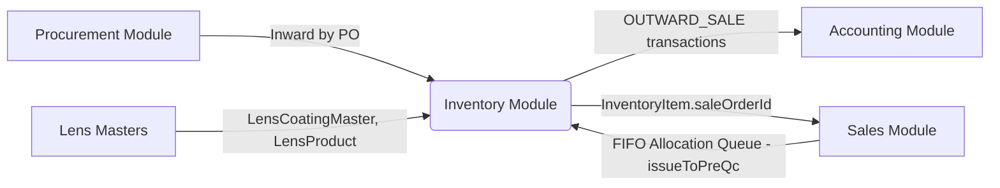

# Module Specification — Inventory

This document details the functional specifications, technical implementation, and cross-module linkages for the **Inventory** module.

---

## 1. Functional Overview

The Inventory module manages:

* **Initial Inward (Manual):** A 3-step wizard (`InventoryInitializationForm.jsx`) lets a user pick a Location → select Type/Category/Lens Product/Coating → enter Sph/Cyl/Add ranges (0.25-step cartesian product via `BulkLensSelection.jsx`) → allocate to trays with per-spec Qty (auto-fills to available gap) and per-spec Price (auto-fills from global cost price). Coating is required before the grid can be displayed. The generated spec list is shown as an expandable card grouped by Coating.
* **Inward by PO:** Purchase-order-driven receipt queue (`POInwardToInventory.jsx`). Confirmed working end-to-end. Live tray capacity badge reflects in-form sibling-row allocations via `siblingAllocatedQty()` — shows **"Tray Full — X/X"** immediately when another row fills the same tray, without waiting for submit.
* **Tray Master / Location Master:** Organizes stock into designated physical bins (trays) inside locations.
* **SO Request Query (tab inside Inventory module):** `InventoryRequestQueueTab.jsx` — lists Sale Orders requiring stock allocation (driven by `INVENTORY_QUEUE_STATUSES`). "Issue & Pre-QC" button opens `StockPickModal.jsx` before transitioning the SO to `PRE_QC`. Includes live filter controls (by Customer, Product, Customer Ref No, and SO Number) and collapsible grouping options (by Customer or Product). No standalone route; reachable only as a tab within the Inventory module.
  * **Stock Pick Modal (Pass D):** Shows the SO's product name + coating + per-eye Sph/Cyl/Add specs at the top. Lists FIFO matches from **both** physical `InventoryItem` rows (`inv_<id>`) and pending `PurchaseOrderReceipt` rows from the Inward Queue (`rec_<id>`, badged "Inward Queue", purple-themed row). Selecting a `rec_` row and confirming auto-inwards that receipt's pending qty (1 unit) into a new `InventoryItem` + `InventoryTransaction` + `InventoryStock` bucket update, then reserves it for the SO — all inside one `prisma.$transaction`.
  * "Raise PO" button (`raisePoFromSo`) — **known gap:** Requirement asked to fix a "Raise PO" failure; no Contract item or bug was identified for it during Pass D (static review of `raisePoFromSo`, its route, and status-transition rules found no issue). Unresolved — needs live reproduction.
* **Transactions Log:** Record of all stock updates for value auditing. Supports filtering by transaction `type` (Pass D) via a dropdown, and can be deep-linked from the Dashboard's Inward/Outward value click-through (`location.state.filterType`).
* **Stock Summary:** Toggle between the original Pivot Grid view and an Expandable List view (grouped by Location / Location+Tray / Category / Lens Product / none), each with its own AND-combined filters; Pivot retains Excel/PDF exports (Pass C/D — complete).
* **Dashboard:** Analytics cards, value trend (now a true daily date-grouped `trend` array from `getStockValueReport`, clickable to deep-link into Transactions pre-filtered by Inward/Outward), Top 10 / Low 10 selling products rendered side-by-side, and Excel/PDF export. "Product Spec Count Trend" card was removed in Pass D (Pass B/D — complete).

> **Nav:** Inventory module tab bar = `Dashboard | Inward Queue | SO Request Query | Transactions | Stock Summary`. The "Items" tab and "Add Item" button have been removed — no manual inventory creation allowed except via Initial Inward or PO Inward.

---

## 2. Technical Design

### Key Frontend Files

| File | Role |
|------|------|
| `InventoryMain.jsx` | Top-level tab router (5 tabs) |
| `InventoryInitializationForm.jsx` | 3-step manual inward wizard |
| `BulkLensSelection.jsx` | Coating + range inputs + Sph×CYL/ADD grid + expandable spec list |
| `POInwardToInventory.jsx` | PO-receipt-driven inward with live tray badge (`siblingAllocatedQty`) |
| `InventoryRequestQueueTab.jsx` | SO queue tab with FIFO stock pick trigger |
| `StockPickModal.jsx` | FIFO allocation dialog reused for Request Queue |
| `InventoryDashboard.jsx` | Stat cards + charts + Excel/PDF export |
| `InventoryStockTab.jsx` | Stock summary pivot + AND-combined filters + Excel/PDF export |
| `InventoryInwardQueueTab.jsx` | PO inward queue listing |
| `InventoryTransactionsTab.jsx` | Transaction log tab |

### Key Backend Files

| File | Role |
|------|------|
| `inventory.service.js` | Core service: `bulkInwardFromGrid`, `reserveInventoryForSale` (qty-aware + `dbClient` threading), `updateInventoryStock`, `generateTransactionNumber`, `getInventorySpecCountTrend`, `getTopLowSellingProducts`, `getInventoryStockPivot`, `getInventoryStockGrouped` (list view), `getStockValueReport` (now returns a daily `trend` array) |
| `saleOrderWorkflowService.js` | `issueToPreQc()` — wraps `reserveInventoryForSale` in a `prisma.$transaction`; threads `tx` as `dbClient` so all eye reservations roll back together on failure. Pass D: also handles `rec_<id>` selections by auto-inwarding the receipt (creates `InventoryItem`+`InventoryTransaction`+stock bucket) before reserving. `raisePoFromSo()` lives in the same file (see known gap above). |
| `saleOrderService.js` | `getMatchingInventoryFIFO()` — Pass D: now also queries matching `PurchaseOrderReceipt`s (filtered to `totalReceivedQty > inwardedQty`) alongside physical stock, returns both `inv_`/`rec_`-prefixed plus the parent `saleOrder` (with product/coating/type) for the modal header |
| `inventory.routes.js` / `inventoryController.js` | REST API layer |

### Key Data Rules

* **`reserveInventoryForSale(inventoryItemId, quantity, saleOrderId, userId, dbClient = prisma)`:**
  - Quantity-aware status flip: if `remainingQty ≤ 0.001` → status = `RESERVED`, `saleOrderId` + `reservedDate` set. Otherwise stays `AVAILABLE` with decremented `quantity`.
  - Accepts optional `dbClient` (defaults to `prisma`). When called from `issueToPreQc`'s `prisma.$transaction`, the transaction's `tx` is passed through so all reservations in one call are atomic.
* **`bulkInwardFromGrid`:** Accepts `coating_id` at top level and optional `costPrice` per `splits[]` entry (falls back to form-level `costPrice` via `??`, not `||` — preserves explicit `0`).
* **Tray Live Badge (PO Inward):** `effectiveAvailable = trayOccupancy.availableQty - siblingAllocatedQty(trayId, excludeRowKey, excludeSplitIdx)`. Badge turns red with "Tray Full — X/X" when `effectiveAvailable ≤ 0`.

---

## 3. Linkages & Dependencies

* **Procurement:** PO receipts feed `InventoryInwardQueueTab`; `POInwardToInventory.jsx` creates `InventoryItem` rows per spec+tray.
* **Lens Masters:** `getInventoryDropdowns()` returns `coatings` (from `LensCoatingMaster`), `lensProducts`, `lensTypes`, `categories` — used by both `BulkLensSelection` and `InventoryInitializationForm`.
* **Sales:** Sale Orders with `INVENTORY_QUEUE_STATUSES` appear in `InventoryRequestQueueTab` (displayed as the **SO Request Query** tab). `issueToPreQc()` calls `reserveInventoryForSale()` per selected `InventoryItem` (or auto-inwards + reserves for a `rec_` receipt selection), transitioning the SO to `PRE_QC`. `getMatchingInventoryFIFO(saleOrderId)` populates `StockPickModal` with FIFO-ordered matches from both physical stock and the Inward Queue.
* **Procurement (extended, Pass D):** `PurchaseOrderReceipt.inwardedQty` now tracks partial consumption from the Sales side too (incremented by `issueToPreQc`'s auto-inward), not just from the dedicated PO Inward screen — any future Procurement-side reporting on receipt pending-qty must account for both sources.
* **Accounting:** `inventoryTransaction.create()` (type `OUTWARD_SALE`) is called inside `reserveInventoryForSale()`, feeding the cost-price valuation used in financial reporting. Pass D adds a second write path: `INWARD_PO`-type transactions created by the auto-inward branch of `issueToPreQc()`.

---

## 4. Pass History

| Pass | Scope | Status | Shipped |
|------|-------|--------|---------|
| **Pass A** | Product Inward flows (1a/1b/1c) + Items tab removal | ✅ QA PASSED | 2026-06-27 |
| **Pass B** | Dashboard analytics (relabel, graphs, Top10/Low10, export) | ✅ QA PASSED | 2026-06-27 |
| **Pass C** | Stock Summary pivot + filters + export | ✅ QA PASSED | 2026-06-27 |
| **Pass D** | Dashboard Top/Low side-by-side + value-trend fix + click-to-filter Transactions; Stock Summary Pivot/List toggle; SO Request Queue — Stock Pick Modal product/specs header + Inward Queue allocation + auto-inward-on-issue | ✅ QA PASSED (static review — no live DB/browser run; see `feature.md` Test results) | 2026-06-27 |
