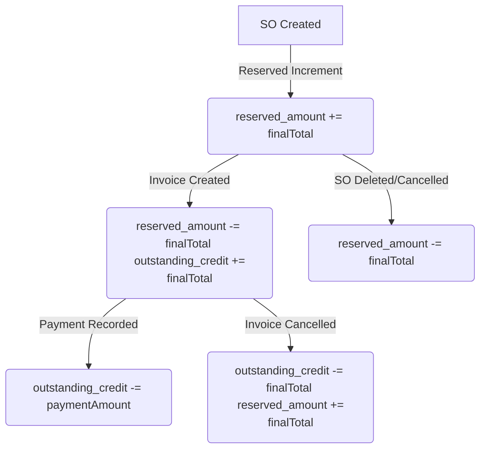

# Sales Module — Sale Orders, Discounts, and Credit Lifecycle

This document details the Sale Order features, pricing logic, discount calculations, and the end-to-end credit exposure lifecycle.

## 1. Pricing & Discount Calculations
To ensure proper billing limits, discounts and promotional percentage offers apply **exclusively to the lens price** (coating price) and do not discount other order extras:
* **Subtotal Components:**
  * Lens Price (base)
  * Fitting Price
  * Tinting Price
  * Right/Left Eye Extra charges
  * Additional custom charges (JSON array)
* **Discount Calculation:**
  $$\text{Discount Amount} = \text{Lens Price} \times \frac{\text{Discount \%}}{100}$$
* **Final Total Calculation:**
  $$\text{Final Total} = \text{Lens Price} - \text{Discount Amount} + \text{Fitting Price} + \text{Tinting Price} + \text{Extras} + \text{Additional Charges}$$

## 2. Credit Exposure Lifecycle (Reserve vs Outstanding)
The system tracks exposure dynamically at every stage of the sale:

### A. SO Created
* Adds computed `finalTotal` to `customer.reserved_amount`.
* **Credit Block:** If `credit_limit > 0` and `reserved_amount + outstanding_credit + newSOTotal >= credit_limit`, the system blocks order creation with a `CREDIT_LIMIT_EXCEEDED` error.

### B. Invoice Created
* Links the Sale Order(s) to an Invoice.
* Moves the invoiced amount from `reserved_amount` to `outstanding_credit`.

### C. Payment Recorded
* Reduces `outstanding_credit` by the payment amount.
* If fully paid, sets the Sale Order status to `COMPLETED`.

### D. Reversals (Delete / Cancel)
* **Delete Sale Order:** Decrements `reserved_amount` by the SO total (only if uninvoiced).
* **Cancel Invoice:** Decrements `outstanding_credit` and increments `reserved_amount` back to indicate active reservation.

### E. Client-Side Read-Only Lock (Credit-Limit View-Mode Lock)
In addition to the server-side hard block on SO creation (§A), `SaleOrderForm.jsx` computes a derived `isCreditBlocked` flag: `credit_limit > 0 && (reserved_amount + outstanding_credit) >= credit_limit`. When true, the entire form collapses to read-only — mirroring the form's existing `mode === "view"` behavior — regardless of whether the route's actual mode is `add`/`edit`/`view`:
* Forces `isEditing = false` (via a `useEffect` watching `isCreditBlocked`), which cascades through the many pre-existing `disabled={... !isEditing ...}` field guards and hides the Calculate Price button (already gated on `isEditing`).
* The 9 fields whose `disabled` prop is keyed directly off `mode !== "add"` (not `isEditing`) — customer, order date, customer ref no, type/category/lens/fitting/tinting/coating selects — each additionally check `|| isCreditBlocked`.
* The Edit/Cancel-Edit toggle button and the Save/Update submit button are disabled/hidden while blocked.
* An inline warning `Alert` banner is shown near the Customer field explaining the read-only state.
* Both the client-side `>=` comparison and the server-side `CREDIT_LIMIT_EXCEEDED` check (§A) use the same `>=` threshold, so they stay consistent — this feature does not change the server-side block, only adds a client-side presentation layer on top.

## Calculate Price Button — Eye-Selection Gate
The "Calculate Price" button in `SaleOrderForm.jsx` requires `customerId`, `lens_id`, and `coating_id` to be set, **and** (since 2026-07-01) at least one of `rightEye`/`leftEye` to be checked — until an eye is selected, the button stays disabled. This composes with the credit-limit lock above: the button's outer render guard (`isEditing && formData.status === "DRAFT"`) is already gated on `isEditing`, so it disappears automatically once the form is credit-blocked.

## Linkages & Dependencies
* **CRM Module:** References `Customer` records and updates credit fields.
* **Accounting Module:** Posts client payments and double-entry sales revenue ledger updates.
