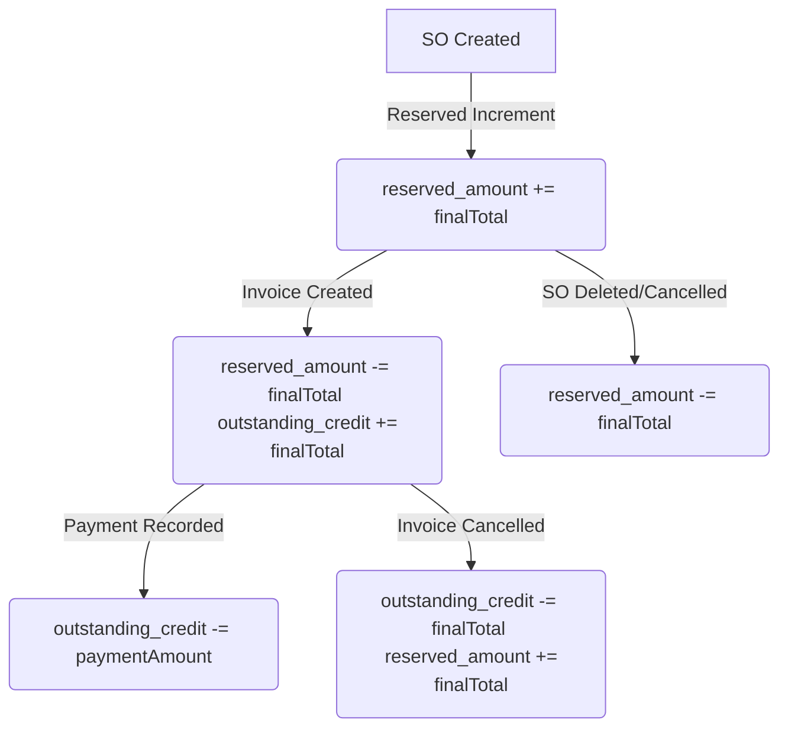

# Sales Module — Sale Orders, Discounts, and Credit Lifecycle

This document details the Sale Order features, pricing logic, discount calculations, and the end-to-end credit exposure lifecycle.

## 1. Pricing & Discount Calculations
To ensure proper billing limits, discounts and promotional percentage offers apply **exclusively to the lens price** (coating price) and do not discount other order extras:
* **Subtotal Components:**
  * Lens Price (base)
  * Fitting Price
  * Tinting Price
  * Right/Left Eye Extra charges
  * Additional custom charges (JSON array)
* **Discount Calculation:**
  $$\text{Discount Amount} = \text{Lens Price} \times \frac{\text{Discount \%}}{100}$$
* **Final Total Calculation:**
  $$\text{Final Total} = \text{Lens Price} - \text{Discount Amount} + \text{Fitting Price} + \text{Tinting Price} + \text{Extras} + \text{Additional Charges}$$

## 2. Credit Exposure Lifecycle (Reserve vs Outstanding)
The system tracks exposure dynamically at every stage of the sale:

### A. SO Created
* Adds computed `finalTotal` to `customer.reserved_amount`.
* **Credit Block:** If `credit_limit > 0` and `reserved_amount + outstanding_credit + newSOTotal >= credit_limit`, the system blocks order creation with a `CREDIT_LIMIT_EXCEEDED` error.

### B. Invoice Created (DRAFT)
* Links the Sale Order(s) to an Invoice (status `DRAFT`).
* Moves the invoiced amount from `reserved_amount` to `outstanding_credit`.
* **No accounting entry posted yet** — `FinancialTransaction` is deferred until the invoice is formally issued (§B2).

### B2. Invoice Issued (DRAFT → ISSUED)
* Invoice status changes to `ISSUED`; linked Sale Orders change to `INVOICED`.
* **Accounting entry posted now** (2026-07-03): `postInvoice()` fires → `FinancialTransaction` type `SALE`: Dr Customer AR / Cr Sales Revenue (AC-3001) / Cr GST Output (AC-2003 if tax > 0).
* Revenue is recognised at issue, not at draft creation.

### C. Payment Recorded (via Accounting Customer Payments — 2026-07-05)
* All customer payments are recorded through **Accounting → Customer Payments** (`CustomerPaymentVoucher`), not per-invoice from Billing.
* Reduces `outstanding_credit` by the **invoice allocation sum** (not advance portion).
* Overpayment excess may be marked **Advance payment** → increments `customer.advance_credit`.
* If fully paid, sets linked Sale Orders to `COMPLETED`.
* **Accounting:** One `FinancialTransaction` (`RECEIPT`) per voucher via `postCustomerPaymentReceipt()` — Dr Bank/Cash, Cr Customer AR for full receipt amount. No per-invoice `postClientPayment()` calls.
* **Status gate:** Payments only on `ISSUED` or `PARTIALLY_PAID` invoices.
* **Allocation:** FIFO by invoice **due date** (ascending); manual override allowed.

### D. Reversals (Delete / Cancel)
* **Delete Sale Order:** Decrements `reserved_amount` by the SO total (only if uninvoiced).
* **Cancel DRAFT Invoice:** Decrements `outstanding_credit` and increments `reserved_amount`. No accounting reversal needed (nothing was posted at DRAFT stage).
* **Cancel ISSUED / PARTIALLY_PAID Invoice (2026-07-03):** Decrements `outstanding_credit` / increments `reserved_amount` for the unpaid portion. Additionally posts a `reverseInvoice()` `FinancialTransaction` type `JOURNAL`: Dr Sales Revenue / Dr GST Output / Cr Customer AR — fully reversing the issue-time posting. For PARTIALLY_PAID invoices, prior payment `RECEIPT` entries (Dr Bank, Cr AR) are left intact; the net Customer AR balance becomes negative (credit) equal to the payments received, representing a refund owed.

### E. Client-Side Read-Only Lock (Credit-Limit View-Mode Lock)
In addition to the server-side hard block on SO creation (§A), `SaleOrderForm.jsx` computes a derived `isCreditBlocked` flag: `credit_limit > 0 && (reserved_amount + outstanding_credit) >= credit_limit`. When true, the entire form collapses to read-only — mirroring the form's existing `mode === "view"` behavior — regardless of whether the route's actual mode is `add`/`edit`/`view`:
* Forces `isEditing = false` (via a `useEffect` watching `isCreditBlocked`), which cascades through the many pre-existing `disabled={... !isEditing ...}` field guards and hides the Calculate Price button (already gated on `isEditing`).
* The 9 fields whose `disabled` prop is keyed directly off `mode !== "add"` (not `isEditing`) — customer, order date, customer ref no, type/category/lens/fitting/tinting/coating selects — each additionally check `|| isCreditBlocked`.
* The Edit/Cancel-Edit toggle button and the Save/Update submit button are disabled/hidden while blocked.
* An inline warning `Alert` banner is shown near the Customer field explaining the read-only state.
* Both the client-side `>=` comparison and the server-side `CREDIT_LIMIT_EXCEEDED` check (§A) use the same `>=` threshold, so they stay consistent — this feature does not change the server-side block, only adds a client-side presentation layer on top.

## Calculate Price Button — Eye-Selection Gate
The "Calculate Price" button in `SaleOrderForm.jsx` requires `customerId`, `lens_id`, and `coating_id` to be set, **and** (since 2026-07-01) at least one of `rightEye`/`leftEye` to be checked — until an eye is selected, the button stays disabled. This composes with the credit-limit lock above: the button's outer render guard (`isEditing && formData.status === "DRAFT"`) is already gated on `isEditing`, so it disappears automatically once the form is credit-blocked.

## Billing UI — "Awaiting Invoice" Tab
The second tab in the Billing page (`/billing`) was renamed from "Dispatch Orders" to **"Awaiting Invoice"** (2026-07-03). It lists all Sale Orders in `DELIVERED` status with `invoiceId: null` — i.e. delivered but not yet billed. Clicking "Create Bill" from this tab opens `CreateInvoiceDialog` pre-filtered to the selected customer.

## Quick Close — Payment Routing (2026-07-05)
Record Payment and Quick Close on Billing invoices **navigate to Accounting Customer Payments** (`/accounts/customer-payments?customerId=&invoiceId=&openForm=1`) with the invoice pre-selected. The legacy `RecordPaymentDialog` is no longer the entry point. `POST /api/invoices/:id/payments` returns HTTP 410.

## Linkages & Dependencies
* **CRM Module:** References `Customer` records and updates credit fields (`reserved_amount`, `outstanding_credit`, `advance_credit`).
* **Accounting Module:** Customer payment receipts via `CustomerPaymentVoucher` + `postCustomerPaymentReceipt()` in `accountingService.js`. Requires `bankLedgerId` from `GET /api/ledgers/cash-bank`.
* **Logistics Module:** Sale Orders must reach `DELIVERED` status (via Dispatch flow) before they appear in the Awaiting Invoice tab and can be invoiced.
