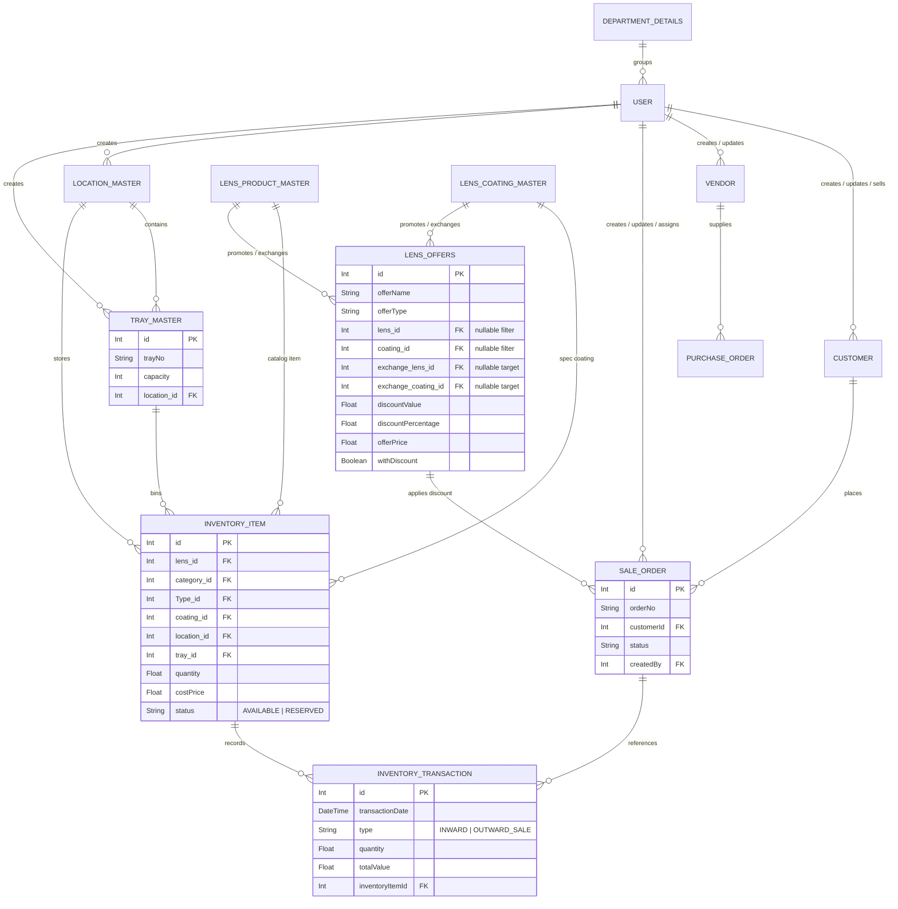

---
v: 1
sections:
  - id: SD-1.1
    title: Database ERD
  - id: SD-2.1
    title: Invoice and customer payment models
  - id: SD-2.2
    title: Income and loan records
---

# Lens Web — Database ERD

This document details the database schema, models, and entity relationships of the Lens Web application.

## Entity Relationship Diagram


```

---

## Core Entities Description

### 1. InventoryItem
Stores physical stock rows. Note that a single row can hold multiple units of identical specs (Sph, Cyl, Add, Coating, etc.) in a specific Tray and Location. Status flips to `RESERVED` when quantity is consumed by a Sale Order. **Per-eye QC (2026-07-26):** `issuedEye` (`IssuedEyeSide` RIGHT|LEFT, nullable) attributes a reserved unit to one SO eye; `isReused` (Boolean, default false) is the persistent REUSED tag after Inward Queue Reuse (location+tray required). Status `RETURNED` = pending Dispose/Reuse. **Reuse (2026-07-27):** on REUSE the row is canonicalized to one eye’s SPH/CYL/ADD + matching `rightEye`/`leftEye` flags (opposite optical fields cleared) so Stock Summary power buckets match the returned lens. **Partial reserve (2026-07-27):** reserving part of an AVAILABLE multi-qty row creates child `RESERVED` rows (`quantity: 0`, `saleOrderId` + `issuedEye`) while the source remains AVAILABLE with decremented qty.

### 1b. InventoryQcReturn
Pending QC reject returns shown in Inward Queue. Fields include `saleOrderId`, optional `inventoryItemId`, `sourceStatus`, `rejectRemark`, `status` (PENDING|REUSED|DISPOSED), and **`eyeSide`** (`IssuedEyeSide?`, required on new rows). Scrap rejects do **not** create rows. Queue listing filters by `saleOrder.procurementType` (RX vs STOCK godown), not item location godown.

### 1c. InventorySpecThreshold (req-013, 2026-08-31)
Per-product, per-godown, per-power-spec min/max stock configuration. Fields: `lens_id` FK, `godownType` (`STOCK`|`RX`), `sph`/`cyl`/`add` (`Decimal(6,2)`, normalized), `minQty` Int≥0, `maxQty` Int? nullable. `@@unique([lens_id, godownType, sph, cyl, add])`. Alerts computed at read from `specQty` (sum `InventoryItem.quantity` by lens + coalescePower, godown-scoped) vs threshold — no writes to `InventoryAlert`. Product-level `LensProductMaster.minThresholdQty`/`maxThresholdQty` retained on schema but deprecated for dashboard KPIs.

### 1d. RefreshToken (req-001, 2026-09-06)
Per-device session row. `User.refreshTokens` 1:n. Unique on `token`; index on `userId` (not unique). Login inserts a row; refresh looks up by presented token; logout deletes only that row. Migration `20260906160000_refresh_token_per_device` drops `refresh_tokens_userId_key`. Password change / admin revoke still clears all of a user's rows.

### 1e. InventoryCycleCountSession / InventoryCycleCountLine (PRD-4.14, 2026-09-14)
Verification-only physical count. Session: `sessionNo` unique, `godownType`, `status` (`PLANNED` | `IN_PROGRESS` | `PENDING_REVIEW` | `POSTED` | `CANCELLED`), optional `location_id`, `recountThreshold`, `startedAt`/`postedAt`, created/updated/posted user FKs. Line: unique `(sessionId, inventoryItemId)`; tray + location FKs; `bookQty` snapshot; `countedQty`/`varianceQty`; `outcome` (`UNCOUNTED` | `MATCH` | `SHORTAGE` | `OVERAGE` | `PENDING_RECOUNT`); `recountCount`. No ADJUSTMENT/DAMAGE/INWARD writes on count or post. Migration `20260914180000_inventory_cycle_count`.

### 2. InventoryTransaction
Records inward (PO / Direct), outward (Sale / Return / Damage), and transfer. **Unit-cost ledger (req-001, 2026-09-08):** `parentTransactionId` (self-FK), `status` (`OPEN` | `CONSUMED`), `remainingQty`. Sources (`INWARD_PO`, `INWARD_DIRECT`, `TRANSFER`) start OPEN with `remainingQty = quantity`. Outward/damage/transfer qty N writes N unit rows each tagged to one OPEN source; source `remainingQty` 0 → CONSUMED. PO inward unit price is finalized on vendor bill, not receipt. `ADJUSTMENT` retained for legacy rows only (no new writes). Migration `20260908120000_inventory_transaction_unit_cost`. **Dashboard month KPIs (PRD-4.12):** calendar-month inward/outward qty+value are computed at read from this table (no new columns).

### 3. LocationMaster & TrayMaster
Represents the physical organization. A Location (warehouse/room) contains multiple Trays (bins). Each Tray has a max capacity limit. **Dashboard Stock Summary (PRD-4.13):** `locationCount` / `trayCount` are distinct non-null `location_id` / `tray_id` on godown-scoped `InventoryStock` at read time (no new columns).

### 4. SaleOrder
Represents sales orders placed by Customers. Triggers stock reservations via `reserveInventoryForSale()` during the Pre-QC workflow transition.

### 5. Customer
Represents customer accounts. Tracks credit limits and exposure dynamically using `credit_limit`, `outstanding_credit`, `reserved_amount` (uninvoiced SO exposure), **`advance_credit`** (prepaid balance from customer payment vouchers with `advanceAmount > 0`, added 2026-07-05), and **`credit_days`** (integer payment terms; invoice `dueDate` = invoice date + credit days when not overridden, added 2026-07-14).

### 6. Customer Payment Voucher (2026-07-05; cancel 2026-07-25)
Header table for consolidated customer receipts. One voucher → one `FinancialTransaction` (`RECEIPT`). Lines in `CustomerPaymentVoucherItem` allocate amounts to invoices; subsidiary `Payment` rows link via `Payment.voucherId`. **`cancelledStatus` / `cancelledAt`** — cancel posts reversing txn and restores allocations; blocked if original FT `isReconciled`.

```
CustomerPaymentVoucher ||--o{ CustomerPaymentVoucherItem : "allocates"
CustomerPaymentVoucher }o--|| Customer : "belongs to"
CustomerPaymentVoucherItem }o--|| Invoice : "clears"
Payment }o--o| CustomerPaymentVoucher : "voucherId"
```

### 7. Vendor Payment Voucher & Vendor Invoice
Invoice-first payables (2026-07): `VendorInvoice` / `VendorInvoiceItem` link supplier invoices to POs; `VendorPaymentVoucherItem.vendorInvoiceId` allocates payments. **`cancelledStatus` / `cancelledAt`** on vouchers (2026-07-25). Eligible-PO query excludes POs already on a non-cancelled Vendor Invoice. **GL timing (req-014):** accrual FT posts on Vendor Bill create (`postVendorInvoice`, `ReferenceType.VENDOR_INVOICE`); PO receipt does not post GL; payment closes AP via `postVendorPayment`.

### 8. Account Groups & Ledger Classification (2026-07-05)

Industry COA hierarchy for Balance Sheet and P&L reporting.

```
AccountGroup ||--o{ AccountGroup : "parentGroupId (self-relation)"
AccountGroup ||--o{ Ledger : "accountGroupId"
Ledger ||--o{ Ledger : "parentLedgerId (AR/AP sub-ledgers)"
```

**`AccountGroup`** — `groupCode` (unique), `groupName`, `nature` (`LedgerType`), `parentGroupId`, `reportSection` (`BALANCE_SHEET` | `PROFIT_LOSS` | `NONE`), `pnlClassification` (`DIRECT_EXPENSE`, `INDIRECT_EXPENSE`, etc.), `isSystemGroup`, `sortOrder`.

**`Ledger` extensions:**
- `accountGroupId` — links posting ledger to its account group
- `isGroupLedger` — true for control ledgers (AC-1003, AC-2001)
- `allowsDirectPosting` — false blocks manual/auto posting to control ledgers

**Seeded groups:** Assets → Current Assets → Cash-in-Hand, Bank Accounts, Sundry Debtors, Inventory, GST Input; **Liabilities → Capital, Loans, Current Liabilities** → Sundry Creditors, GST Output, TDS; Income/Expense Direct & Indirect sub-groups. **req-003 (2026-09-08):** `GRP-CAPITAL` nature LIABILITY, parent `GRP-LIABILITIES`; `GRP-LOANS` + ledger `AC-2004` Loans Payable; AC-5001/AC-5002 `ledgerType` LIABILITY. Balance Sheet roots are Assets + Liabilities only (Capital nested). Migration `20260908180100_capital_loans_liability`.

**Seed script:** `node prisma/seed/account-groups-seed.js` (run after migration `20260705140000_account_groups`).

**Customer/vendor sub-ledgers** (`AC-1003-C*`, `AC-2001-V*`) inherit `accountGroupId` from Sundry Debtors / Sundry Creditors on create.

### 9. Expense (2026-07-14; liability ledger 2026-08-31)
`Expense.dueDate` (`DateTime?`) stores optional payment due date distinct from `expenseDate`. **req-003:** `expenseDate` must be on or before `dueDate` (mark + cash paths); GL `transactionDate` = `expenseDate` (mark/cash) or `paymentDate` (pay). Category still drives DIRECT/INDIRECT via `ExpenseCategory.expenseType`.

**Indirect accrual track (req-007):** `Expense.liabilityLedgerId` FK `Ledger` — the "Expense for" liability posting account. `vendorExpenseStatus` (MARKED / PARTIALLY_PAID / PAID) + `paidAmount`. `vendorId` null on create for this track. Payment audit: `IndirectExpensePaymentVoucher` + `IndirectExpensePaymentVoucherItem` (`expenseId`). Migration `20260831120000_indirect_expense_liability_ledger` backfills `liabilityLedgerId` from `Vendor.ledgerId` then clears `vendorId`.

### 10. Income & Income Category (2026-07-25; From/To follow-up)
Mirrors Expense: `IncomeCategory` + `Income`. Create requires `fromLedgerId` + `toLedgerId`. **req-003:** Income From = `GRP-CAPITAL` posting ledgers; Loan From = `GRP-LOANS`; To = Cash/Bank. Posting **Dr To, Cr From**; FT date = `incomeDate`. `IncomeCategory` name `Loan` remains the tab discriminator; AC-3004 stays INCOME classification (not Loan From). Legacy `bankLedgerId` optional/nullable after migration `20260725100000_income_from_to_ledgers`.

### 11. Credit / Debit Notes behavior (2026-07-25)
UI: Customer **Credit Note** only; Vendor **Debit Note** only (create of Customer DN / Vendor CN rejected). New Customer CN / Vendor DN are document-only (no party AR/AP FT). Historical other note types remain in DB.

## SD-2.1 Invoice and customer payment models

- `Invoice` — billed from Sale Orders; **`billDate`** (req-002, optional; default today on create; GL date on issue, else `createdAt`); `dueDate` defaults to `billDate + Customer.credit_days`; statuses include ISSUED / PARTIALLY_PAID / PAID / CANCELLED. `billDate` is nullable so legacy rows are not blocked.
- `CustomerPaymentVoucher` + `CustomerPaymentVoucherItem` — receipt header/items; `advanceAmount`; links to `Payment.voucherId`.
- `Customer.outstanding_credit`, `Customer.advance_credit`, `Customer.credit_days`, `Customer.credit_limit`.

## SD-2.2 Income and loan records

- `IncomeCategory` + `Income` — From/To ledger IDs; Loan is a seeded category (not a separate table unless a future request adds one).
- Soft-delete reverses via `postReversingTransaction`.

